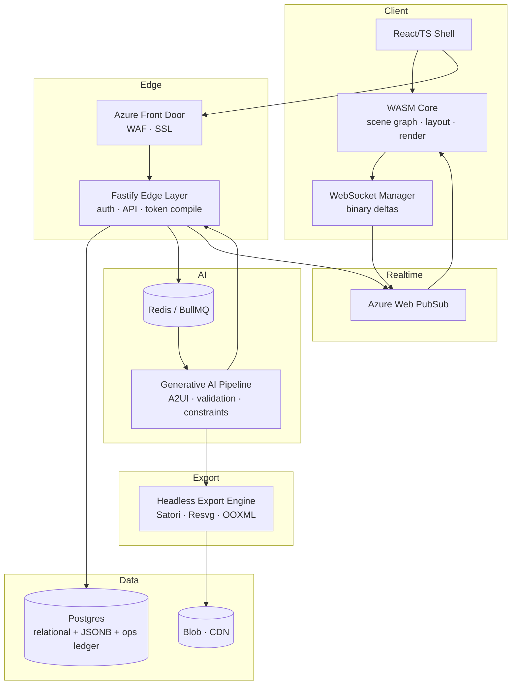
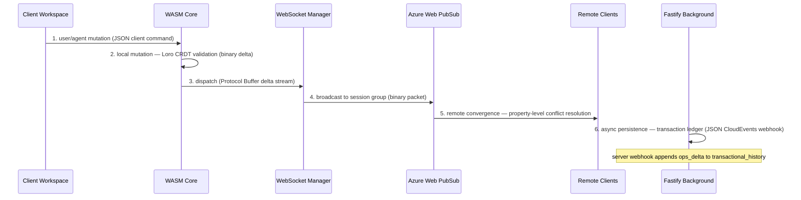
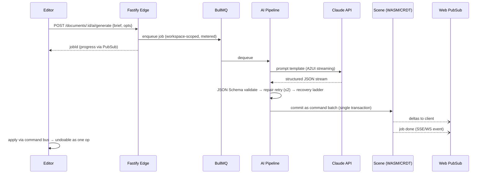

# Chapter 2 — High-Level Distributed System Architecture

Per the spec: five primary operational components, one bidirectional execution loop.

## 2.1 The five components

1. **Client Visual Workspace** — React/TypeScript shell (toolbars, drawers, panels) around a
   **WASM core engine** (Rust/C++) that owns the scene graph, layout solving, and **WebGPU**
   rendering (WebGL 2.0 fallback). See Chapters 3–4.
2. **Fastify Edge Server Layer** — high-throughput services for authorization, API
   processing, and design-token compilation. See Chapters 10, 12.
3. **Azure Web PubSub Router** — managed WebSocket transport for low-latency delta sync,
   presence, and job progress. See Chapter 7.
4. **Generative AI Pipeline** — asynchronous orchestrator: LLM execution (direct Anthropic
   API, suite shared runtime), structured-output validation, constraint resolution, A2UI
   streaming. See Chapter 8.
5. **Headless Document Export Engine** — serverless Satori (JSX/CSS → SVG) + Resvg (SVG →
   PNG) pipeline; OOXML compilation for PPTX. See Chapter 13.

## 2.2 Component map



## 2.3 Visual update loop (spec operational sequence)



Key properties:

- **Optimistic local apply** — the WASM core validates and applies instantly; nothing blocks
  on the network.
- **Binary, not JSON, on the wire** — deltas as Protocol Buffers; presence as lightweight
  frames that bypass the database entirely.
- **Persistence is asynchronous** — the edge layer receives the ledger via CloudEvents
  webhook, keeping interactive latency off the write path.
- **Idempotency** — every command/delta carries `clientId`; dedupe at both Web PubSub and
  the ledger.

## 2.4 Core flow: AI generation (worker pipeline)



Failure policy (per spec §8 recovery): incomplete JSON → stream-parser closes brackets +
defaults; unknown widget → standard frame + warning; missing token → root theme fallback;
circular parent → Kleppmann solver breaks the cycle, re-attaches to root. No silent partial
decks; a `failed` job surfaces the error in the UI.

## 2.5 Current state → target (migration map)

| Concern | Current (2026-07) | Target | Phase |
|---|---|---|---|
| Editor core | React DOM divs + CSS transforms | React shell + WASM core + WebGPU | P2 |
| Document | `slides[].elements[]` arrays, loose types | Normalized `Map<NodeID, …>` + affine + tokens | P0 |
| History | In-memory 50-snapshot JSON (`mutate`/`pushHistory`) | Command bus, inverse ops, ledger-derived undo | P0 |
| Sync | None | Azure Web PubSub + Loro deltas | P3 |
| AI calls | Inline REST (`/carousel/generate`, `/carousel/edit`, `/carousel/ai-image`) | Queue-backed A2UI pipeline, metered | P1 |
| Export | Client html2canvas → PNG/PDF (jsPDF) | Serverless Satori + Resvg; OOXML PPTX | P1 |
| Backend | Single-file FastAPI (`backend/server.py`) | Fastify microservices | P2–P3 |
| Database | MongoDB (`carousels`, `brandkits`, `carousel_images`) | Postgres relational + JSONB + ops ledger | P3 |
| Queue | None | Redis / BullMQ | P1 |
| Infra | Azure App Service + Mongo Atlas | Front Door + Web PubSub + PG + Redis (spec SKUs) | P3 |

Phasing rule: **never rewrite the whole product at once.** Phase 0 keeps the current editor
and server, introduces command semantics + typed scene graph (Ch. 3, 5) inside them, and
ships continuously. Each subsequent phase is a deployable increment.

## 2.6 API surface (v1, high level)

```
REST
  POST /documents                      create deck from brief (AI wizard)
  GET  /documents/:id                  scene graph + head version (frontier hash)
  POST /documents/:id/commands         apply command (optimistic client, clientId)
  GET  /documents/:id/events?since=    event log (history, rebase, audit)
  POST /documents/:id/ai/generate      enqueue AI job (brief, slide, style, brand…)
  GET  /jobs/:jobId                    job status
  POST /assets (multipart)             uploads → Blob + CDN URL
  GET  /assets/:id
  POST /documents/:id/export           {format: png|pdf|pptx|linkedin}
  GET  /exports/:id                    download (async result)
  GET  /brandkits · POST/PUT/DELETE    brand kits (existing contract, extended)
  POST /mcp                            MCP endpoint (or dedicated WSS transport)
WS (Azure Web PubSub)
  /documents/:id/events                command/delta broadcast, job progress, presence
```

---

© INNOIRA Consulting Services 2026 · CONFIDENTIAL
