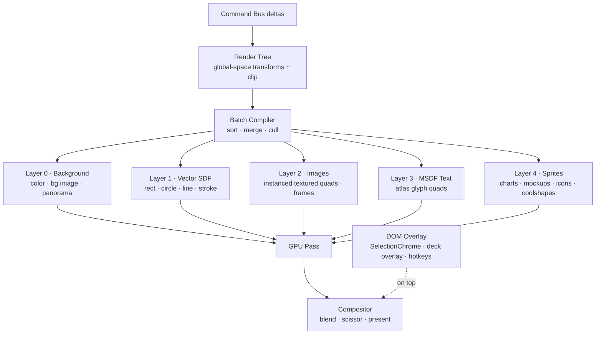

# Chapter 4 — Rendering Architecture (WebGPU Pipeline)

## 4.1 Pipeline decomposition

Rendering is a pipeline from the scene graph to pixels, never a per-component paint:



**One scene → one render tree → one frame.** There is no per-component rendering: the
render tree is a flat, already-sorted, globally-transformed draw list produced from the
scene graph (node affine × parent affine, spec §5). The compositor paints layers in order
with per-layer blend state.

## 4.2 Graphics context & fallback ladder

```ts
interface GraphicsContext {
  supports: { webgpu: boolean; webgl2: boolean };
  beginFrame(viewport: Rect): void;
  scissor(rect: Rect | null): void;              // GPU-side clip (dirty-rect pass)
  drawInstanced(program: Program, batch: Batch, count: number): void;
  uploadAtlas(tex: TextureRegion, data: Uint8Array): void;
  present(): void;
}
```

| Tier | Backend | When |
|---|---|---|
| 1 | **WebGPU** (WGSL via TSL) | Preferred — compute-capable, multi-threaded, multi-draw |
| 2 | **WebGL 2** (GLSL ES 3.0) | Fallback — same instancing model, no compute |
| 3 | Canvas 2D | Interim dev tier for the render-tree pipeline (P1), not a ship target |
| 4 | DOM renderer | Current state; retained until the canvas renderer passes pixel gates |

Shader authoring: **one TSL source** compiled to WGSL for WebGPU and GLSL ES 3.0 for
WebGL2 (spec §4). No duplicate shader codebases. Feature gate at startup; renderer
selection is invisible to the command bus and the scene.

## 4.3 Dirty-rect scissor pass

The spec's frame optimization, applied exactly:

1. **Delta collection** — the command bus emits `RenderDelta { nodeIds, region }` (the
   union of affected node global bounds, inflated by shadow blur + 1px AA margin).
2. **Screen-space intersection** — regions are transformed by the camera and intersected
   with the current viewport; results are unioned and clamped to canvas bounds.
3. **Scissor + selective repaint** — `scissor(rect)`; the GPU clears *only that region* and
   the batch compiler re-issues only draw calls whose bounding boxes intersect it
   (per-batch scissor culling).
4. **Budget cap** — if accumulated dirty area exceeds ~40% of the canvas, fall back to a
   full frame (a pathological frame costs less than a fragmented one).

Deltas carry element-type info so text-only regions can skip the image layer and vice
versa. In P0/P1 the same delta stream drives React-level skipping (only affected elements
re-render) — the mechanism is backend-agnostic.

## 4.4 GPU-instanced batching

**Vertex model.** Every node renders one quad (two triangles, 6 vertices, 4 floats/vertex).
Per-instance attributes encode the full visual state — thousands of shapes in one draw call:

| Instance attribute | Layout | Use |
|---|---|---|
| `aTransform` | mat3 (column-major, 12×f32) | node global affine (2D, expanded) |
| `aUvRect` | vec4 (u,v,u2,v2) | rect into the texture atlas |
| `aColor` / `aColor2` | vec4 ×2 | solid fill; gradient stops |
| `aRadius` | vec4 | corner radii (top-left … bottom-right) |
| `aOpacity` | f32 | node alpha |
| `aParams` | vec4 | per-program extras: stroke width, gradient angle, filter amounts, sdf flags |

**Batches** are grouped by (program, texture handle, blend mode) and merged when state
matches — the compiler's goal is `< 100 draw calls` for a dense slide at 5,000 nodes.

**Shapes are SDF, not geometry.** rect/circle/rounded-rect/triangle/star/line share one
fragment program that evaluates signed-distance against `aParams` (current shape set in
ElementRender.jsx:246-291 + `SHAPE_KINDS` map 1:1 into SDF cases). Strokes are SDF
band-difference; gradients are two-stop uniforms (current gradient angle model,
ElementRender.jsx:266). No per-shape vertex uploads, no tessellation.

**Texture atlas.** Small images (logos, icons, frames) are packed into a shared atlas
(bin-packing, LRU eviction, budget ~64 MB); large images (full-slide photos) get dedicated
textures. Uploads happen on demand — `asset.replace` / `node.set` with `src` changes mark
the texture dirty, never rebuild the atlas.

**Shadows** are drawn as a blurred SDF of the shape quad into the layer below (one extra
instanced draw per shadowed node), not `filter: drop-shadow` evaluation.

**Filters** (brightness/contrast/saturate/blur, current `el.filters`, ElementRender.jsx:104-106)
become fragment uniforms on the GPU path; for sprite elements they're baked into the sprite
on dirty.

## 4.5 MSDF typography

**Why not browser text / plain alpha glyphs.** GPU text needs cached glyph atlases; alpha
atlassed glyphs degrade at scale (bilinear smearing, no crisp zoom); browser text isn't
available in the canvas path at all. MSDF (spec §4) fixes both: three-channel distance
fields stay sharp at any zoom, one atlas per family, and layout is fully deterministic.

**Pipeline.**
1. Load the font (existing Google Fonts manifest — `waitForProjectFonts`/`ensureProjectFontsLoaded`
   in the editor; the server already resolves the catalog, server.py:3636).
2. Parse + generate **MSDF atlas** per font family at a fixed 32px reference size — glyph
   metrics stored per glyph (bearing, advance, kern pairs). Generation runs once per font
   (wasm `msdfgen` in the worker), cached in IndexedDB; total atlas budget ~64 MB.
3. **Layout in the core, not the browser.** Line breaking, letter-spacing, kerning, and
   alignment replicate today's `textStyleOf(el, palette)` output (utils.js) so text renders
   identically on DOM and canvas paths. Text nodes become one glyph quad per character,
   batched in the text layer.
4. **Fragment shader** — median-of-three distance test with antialiasing:

```wgsl
@fragment
fn frag(in: VertexOut) -> @location(0) vec4f {
  let d = median(in.color.r, in.color.g, in.color.b) - 0.5;
  let alpha = clamp(d * fwidth(in.color.r) + 0.5, 0.0, 1.0);
  return vec4f(in.fg, in.opacity * alpha);
}
```

Bulletproof at every zoom; zero texture reallocations during scale (the spec's requirement).

**Fallbacks:** WebGL2 uses the same atlas + GLSL equivalent; Canvas2D tier uses regular
canvas text; P0 DOM uses browser text unchanged. Export (Ch. 13) consumes the same layout
metrics for deterministic rasterization.

## 4.6 Element → render path matrix

| Current element (ElementRender.jsx) | Render path |
|---|---|
| text | MSDF glyph layer |
| shape (rect/circle/rounded/triangle/star/line) | SDF instanced vector layer |
| image (plain + frames) | Textured quad; frames via clip/radius uniforms; filters as uniforms |
| image (mockups: polaroid/browser/filmstrip) | Sprite — offscreen-render to texture on dirty |
| badge | SDF pill + MSDF label |
| chart / kpi / timeline / funnel / progress | Sprite (SVG → offscreen canvas → texture), re-rendered on data/theme dirty |
| icon (lucide etc.) | Sprite or instanced (icon paths cached as SDF/geometry atlases) |
| coolshape | Sprite (existing renderer, cached per shape index) |
| card styles | SDF + MSDF composite (flat/elevated/outlined/bento/split are just fills+strokes+text) |
| bg image / panorama | Full-bleed textured quad with cover/crop math (`renderBackgroundImageCss` semantics) |
| deck overlay (slide #, progress dots, branding, swipe hint) | **DOM overlay** on top of the canvas (cheap, crisp, matches today's `DeckOverlay`) |
| SelectionChrome | **DOM overlay** — unchanged (already screen-space, SelectionChrome.jsx) |

Rule: anything expensive to GPU-render is cached as a **sprite** and invalidated only on
its own dirty region; sprites keep the instanced layers (SDF/text/images) — the common,
hot path — fast.

## 4.7 Camera & world→screen

Zoom/pan live in the core as a camera affine (no CSS `transform: scale`). Renderer
composites `camera × nodeGlobalMatrix`. Hit-testing inverts the same math (today's
coordinate conversion in SelectionChrome is replaced by core math). The 1:1 export
relationship falls out naturally: the export renderer (Ch. 13) is the same render tree at
camera = identity.

## 4.8 Performance targets

| Metric | Target |
|---|---|
| Frame stability | 60–120 fps; drag repaints ≤ dirty region only |
| Draw calls / dense slide (5,000 nodes) | < 100 |
| Instanced draws | 1 for all SDF shapes, 1 for all text glyphs, ≤ N textures |
| Atlas budget | ~64 MB glyph + ~64 MB image, LRU |
| Frame allocs | zero per-frame JS allocations in the hot loop (typed arrays reused) |
| Interaction | pointer → paint < 16 ms at ≤ 5,000 nodes |

## 4.9 Migration & gates

1. **P0** — introduce the render-tree + dirty-delta abstraction at the React level
   (memo'd skip + region tracking); freeze golden renders of the current DOM output.
2. **P1** — Canvas2D tier behind `GraphicsContext` to shake out the pipeline; parity vs
   DOM renderer pixel-diffed on golden decks (all 15 element types, mockups, filters,
   shadows, panorama, fonts).
3. **P2** — TSL → WGSL/GLSL instanced tier; SDF + MSDF land; Canvas2D tier demoted to dev
   only; DOM renderer retained behind the same `GraphicsContext` as the final fallback.

**Gates:** pixel-diff ≤ 0.5% vs DOM golden set at zoom 100%; latency budget above; all
existing interaction tests pass on the canvas path; no regression in PNG/PDF export
(fidelity is a renderer property — Ch. 13 consumes the render tree).

---

© INNOIRA Consulting Services 2026 · CONFIDENTIAL
