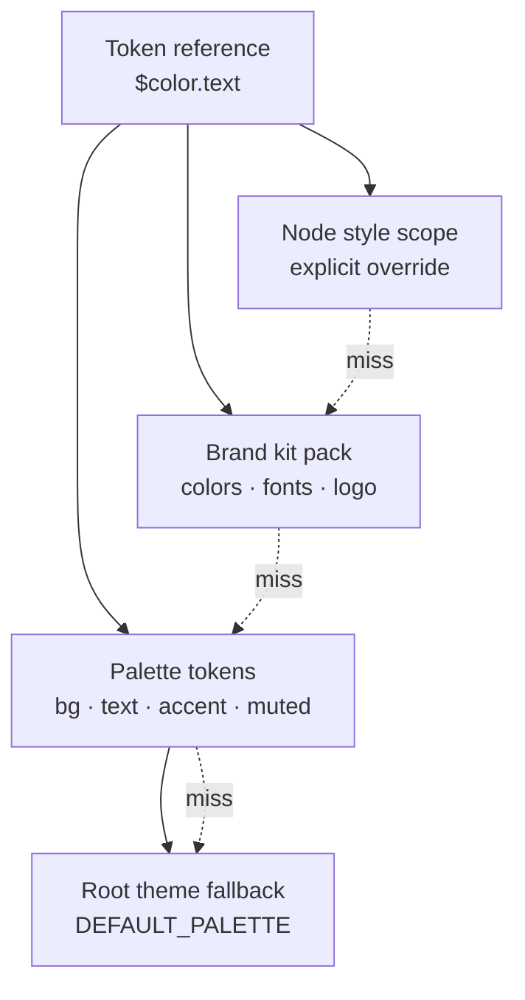

# Chapter 5 — Document Model (Normalized Scene Graph)

## 5.1 Design goals

1. **O(1) access** — nodes are a flat map, not nested trees (spec §5); structure is a
   *parent link*, not containment.
2. **Data first, pixels second** — every visual property is a JSON value or token
   reference; rendering is a compiler over this data.
3. **Order as data** — sibling order is a sortable `fractionalIndex`, not array position.
4. **Geometry as affine** — position/rotation/scale/flip collapse into one 3×2 matrix
   (spec §5); no special-case fields.
5. **Layout as display mode** — every node declares `display: flex | absolute`; absolute
   is today's coordinate model, flex is the AI-native responsive model (Ch. 9 compiles
   absolute → flex).
6. **Theme as tokens** — colors/fonts/radii are DTCG token references resolved through
   themes; brand kits are token packs.

## 5.2 Document envelope

```ts
interface Doc {
  id: string;
  workspaceId: string;
  meta: { platform: "linkedin" | "square" | "twitter"; topic: string;
          createdBy: string; createdAt: string; updatedAt: string;
          version: number /* schema version */; };
  slides: SlideNodeID[];          // ordered slide roots (fractionalIndex)
  themeId: string;                // resolved theme = palette + brand token pack
  brand: BrandState;              // active brand kit binding (existing shape, extended)
  overlay: { showSlideNumbers: boolean; showProgressDots: boolean;
             showSwipeHint: boolean; showBranding: boolean; };  // deck overlay
}
```

`brand` and `overlay` keep today's field names (`show_slide_numbers` etc. snake_case in
the wire format — the hydrator maps, see 5.8) so existing saved decks and the projects
list keep working.

## 5.3 Scene map

```ts
type NodeID = string; // uuid, as today

interface SceneNode {
  id: NodeID;
  type: NodeType;
  parentId: NodeID | null;      // slide root or container; null = document root (slides)
  transform: Mat3x2;            // local affine — THE spatial property (spec §5)
  zIndex: FractionalIndex;      // sibling order within parent
  display: "flex" | "absolute";
  // shared visual props
  opacity: number;
  visible: boolean;
  locked: boolean;
  name?: string;
  blend?: "normal" | "multiply" | "screen";
  shadow?: { color: TokenRef; x: number; y: number; blur: number };
  // typed props (per registry, 5.4)
  props: NodePropsOf<T>;        // discriminated by `type`
}
```

The scene is `Map<NodeID, SceneNode>` (spec §5). Children are derived by scanning
`parentId` — the renderer/flatten pass does one O(N) sort with `zIndex` when a frame
needs a draw list; **interactive ops never traverse**, they look up.

Slide = a root node whose type is `"slide"` with `display: "flex"` (column) by default —
slides themselves are layout containers, which is what makes panorama/overlay/grid
uniformly composable.

## 5.4 Node registry (typed props)

One entry per element type; schema-validated (zod); new types are registered data, not
new code (Ch. 15). Mapping to today's fields (ElementRender.jsx / RightPanel.jsx):

| type | Key props (abridged) | Current fields (map 1:1) |
|---|---|---|
| slide | `bg: TokenRef`, `bgImg?`, `bgFit` | `slide.bg`, `slide.bg_img` |
| text | `text`, `font: TokenRef`, `size`, `weight`, `letterSpacing`, `lineHeight`, `align`, `deco`, `textShadow` | `el.text/fontFamily/fontSize/…` + `textStyleOf` |
| image | `src`, `fit: cover\|contain`, `radius: TokenRef`, `frame?`, `effect?`, `filters`, `imgOffsetX/Y/Scale` | `el.fit/radius/frame/effect/filters/imgOffset*` |
| shape | `kind: rect\|circle\|rounded\|triangle\|star\|line`, `fill: TokenRef`, `fill2?`, `gradientAngle`, `stroke?`, `strokeW`, `radius` | `el.shape/fill/fill_type/fill2/gradient_angle/stroke_only/border_w/border_color/radius` |
| badge | `text`, `bg: TokenRef`, `fg: TokenRef`, `radius`, `size` | `el.text/bg/color/radius/size` |
| icon | `name`, `set`, `color: TokenRef`, `stroke` | `el.name/set/color/stroke` |
| coolshape | `category`, `index`, `color: TokenRef`, `noise`, `size` | `el.shape_category/shape_index/…` |
| chart | `chartType`, `data`, `labels`, `accent: TokenRef`, `muted: TokenRef` | `el.chart_type/chart_data/chart_labels/color/muted_color` |
| progress / kpi / timeline / funnel / card | current prop sets, colors → TokenRef | as today |
| group | — | replaces `slides[].groups` metadata with real parent links |

Migration rule: the hydrator translates legacy element objects into `SceneNode`s by this
table; the reverse (serialize) emits the old shape for any client that still reads it.
`el.x/y/w/h/rotate/flip_*` → matrix (5.5); array order → `fractionalIndex` (5.6).

## 5.5 Affine transforms (spec §5)

**Storage.** `Mat3x2 = [a, b, c, d, e, f]` (column-major 2×3, the conventional canvas
form) representing:

```
| a  c  e |   x' = a·x + c·y + e
| b  d  f |   y' = b·x + d·y + f
```

**Composition.** Global = parent-global × child-local (spec §5):

```ts
// multiply(childLocal, parentGlobal) — row-vector convention: v' = v · M
const mul = (L: Mat3x2, P: Mat3x2): Mat3x2 => [
  L[0]*P[0] + L[1]*P[3],
  L[0]*P[1] + L[1]*P[4],
  L[2]*P[0] + L[3]*P[3],
  L[2]*P[1] + L[3]*P[4],
  L[4]*P[0] + L[5]*P[3] + P[2],
  L[4]*P[1] + L[5]*P[4] + P[5],
];
```

**Factories & decomposition** (shared-utils; used by every gesture):

```ts
const translate = (x: number, y: number): Mat3x2 => [1,0, 0,1, x, y];
const rotate    = (deg: number): Mat3x2  => { const r = deg*Math.PI/180, c = Math.cos(r), s = Math.sin(r); return [c,s, -s,c, 0,0]; };
const scale     = (sx: number, sy: number): Mat3x2 => [sx,0, 0,sy, 0,0];
const fromBox   = (x: number, y: number, w: number, h: number) =>
  translate(x, y) ⋅ scale(w, h);                        // box = unit square scaled
const toBox     = (M: Mat3x2): {x,y,w,h} => decompose(M); // w=|a|·1, h=|d|·1, skew→0
```

**Current-field mapping** (P0 bridge): `transform = translate(x,y) ⋅ rotate(deg) ⋅
scale(w · flipX, h · flipY)` with `flip_h`/`flip_v` as negative scale. Rotation-around-
center and the anchored-resize math (CreateEQEditor.jsx:896) become pure matrix ops —
eliminating today's ad-hoc resize code. Hit-testing, snapping, and the SelectionChrome
all consume the same matrix, so canvas-space and screen-space stay in sync at any zoom.

## 5.6 fractionalIndex (sibling order)

Sibling order is a base-16 **midpoint** sortable string (spec §5):

```ts
const B = "0123456789abcdef";
function mid(a: string, b: string): string {   // a < b
  let out = "", i = 0;
  for (;; i++) {
    const ca = i < a.length ? a[i] : "0", cb = i < b.length ? b[i] : "f";
    if (ca !== cb) {
      const ai = B.indexOf(ca), bi = B.indexOf(cb);
      if (ai + 1 === bi) {                        // adjacent digits → extend
        out += ca;
        return out + (a.length > i+1 && a[i+1] < "f" ? "" : mid(a, "f"));
      }
      return out + B[Math.floor((ai + bi) / 2)];
    }
    out += ca;
  }
}
const between = (prev: string, next: string): string =>
  prev === "" ? (next === "" ? "8" : mid("", next)) : mid(prev, next ?? "f");
```

- **Ops never reindex**: insert/duplicate/move = compute one new index (worst case a few
  retries with +1 hex digit). Array-order today → assign `fractionalIndex` in a hydration
  pass (`n.toString(16)` sequence).
- **CRDT-ready**: fractional indices merge without conflict, which is precisely why the
  spec mandates them — no renumbering under concurrency (Ch. 6).
- Render/board view sort by `zIndex` per parent; `node.reorder` is the only command that
  touches order.

## 5.7 Display model: flex vs absolute

| mode | semantics | used by |
|---|---|---|
| `absolute` | current coordinate model; transform positions the box exactly | imported/legacy decks, hand-tuned layouts |
| `flex` | box is placed by the **layout solver** (direction, gap, align, justify, wrap, padding); `transform` only rotates/overrides | AI-generated decks (Ch. 9), slides, groups, frames |

```ts
interface FlexProps {
  direction: "row" | "column";
  gap: TokenRef | number;
  align: "start" | "center" | "end" | "stretch";
  justify: "start" | "center" | "end" | "between" | "evenly";
  wrap: boolean;
  padding: [number, number, number, number];  // t r b l
  basis?: "auto" | "fill" | "content";        // grow/shrink policy
}
```

**Slide = flex column root** (`direction: column`, `gap`, `padding`) — the deck layout
knob AI uses (spacing, stacking) instead of absolute pixels. Containers (frames, groups)
are flex-capable nodes; a group node with `display: flex` is what makes
group-move/resize coherent (parent link instead of today's `elementIds` metadata,
CreateEQEditor.jsx:410-421).

**Layout solver** (core, Ch. 3 interface `solveLayout`): flex compile is deterministic and
pure — same inputs, same boxes — which is the property export and AI layout depend on.
Absolute children inside a flex parent keep working (mixed mode), preserving all legacy
decks. Solver output is cached per-container and invalidated only by contained-node
deltas (Ch. 4 dirty regions).

## 5.8 DTCG design tokens

Colors, fonts, radii, and spaces are **token references** (`$color.text`, `$font.body`,
`$radius.md`) resolved through a theme (spec §5 `backgroundColor: TokenReference`):

```ts
interface Token { name: string; $type: "color"|"fontFamily"|"fontSize"|"number"|"spacing";
                  $value: string | number | [number,number,number,number]; }
interface Theme { id: string; tokens: Token[]; /* palette + font + brand pack merge */ }
```

**Resolution & scopes**:



Missing token → **root theme fallback** (spec §8 recovery ladder — exact semantics: warn
in agent mode, resolve silently for human decks). `resolveColor("text", palette)` today
becomes `resolveToken("$color.text", theme)`. Brand kits become token packs with a
defined precedence above palette but below explicit node overrides — matching current
brand-apply semantics (palette_id + colors + fonts + logo, CreateEQEditor.jsx:1328-1358).

## 5.9 Serialization, versioning, hydration

```ts
interface WireDoc {               // server payload (JSONB row in Postgres, Ch. 11)
  id: string; workspaceId: string; schemaVersion: number;
  themeId: string; brand: BrandState; overlay: OverlayState; meta: Meta;
  scene: Record<NodeID, SceneNode>;     // flat map (spec §5)
  slideOrder: FractionalIndex[];        // slide roots
}
```

- **Hydrator** (`hydrate`): legacy `{slides, palette_id, groups, …}` → `WireDoc`
  (5.4 table + matrix + fractionalIndex + token mapping). `stripLocalKeys` semantics
  preserved for save.
- **Schema version** on every doc; hydration is version-ordered (v0 → v1 → v2…), each
  step lossless where possible, warned otherwise. Old clients reading new docs keep the
  reverse mapping until all clients are current.
- The **command ledger is not part of the document**: commands live in
  `transactional_history` (Ch. 6/11); the doc is a consolidated state + frontier hash.
  Version restore = ledger replay to a frontier (spec §6 state frontiers).

## 5.10 Implementation order & gates

1. `shared-utils`: Mat3x2 + fractionalIndex + token resolver (ported `resolveColor`).
2. Scene `Map<NodeID, …>` refactor inside `core-js`; hydrator v0↔v1; registry zod
   schemas for all 15 types.
3. Swap `rotate/flip` composition + resize math onto matrices (keep DOM renderer).
4. Groups → parent links; slides → flex containers (solver v1 = absolute passthrough).
5. DTCG tokens + theme packs (brand kits as packs).

**Gates:** all saved decks round-trip hydrator (pre/post identical pixels); z-order
unchanged after fractionalIndex assignment; interaction tests green; token resolution
falls back to root theme on any miss.

---

© INNOIRA Consulting Services 2026 · CONFIDENTIAL
