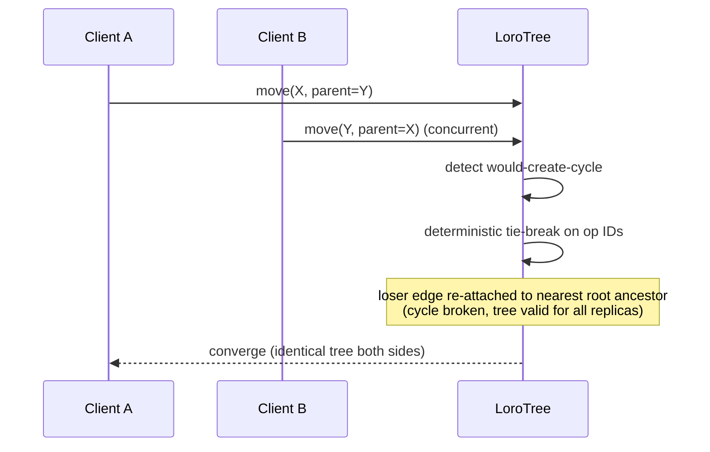

# Chapter 6 — State Management (Loro CRDTs, History, State Frontiers)

## 6.1 Layered state architecture

State flows through four layers with strict boundaries:

```mermaid
graph TB
  subgraph Intent
    CMD[Commands (Ch. 3)<br/>human gestures · AI actions · batchId]
  end
  subgraph CRDT["CRDT layer (Loro, local-first)"]
    OPS[Binary op deltas<br/>LoroMap · LoroList · LoroTree]
    VV[Version vectors · frontiers]
    UNDO[Undo/redo manager<br/>inverse ops]
  end
  subgraph Persistence
    LEDGER[Server ledger<br/>transactional_history · CloudEvents]
    SNAP[Consolidated snapshots]
  end
  subgraph View
    RENDER[Render tree + React shell state]
  end

  CMD --> OPS
  OPS --> UNDO
  OPS --> LEDGER
  SNAP --> OPS
  VV --> LEDGER
  OPS --> RENDER
```

- **Commands are intent** (JSON, idempotent, Ch. 3); **ops are the CRDT's binary effect**
  (spec §2: "Binary Delta State Representation").
- The document is **local-first**: a command applies in the WASM core instantly; sync and
  persistence are asynchronous (spec §2 stage 6). Nothing blocks on the network.
- Every layer can be reconstructed: doc = consolidated snapshot + op chain; ops = command
  ledger replay; render = deterministic function of the CRDT state.

## 6.2 Why Loro (and not Yjs)

Spec mandates Loro. The decisive properties vs. alternatives:

1. **Rust/WASM core** — the CRDT engine lives inside `core-wasm` with the scene and
   renderer; no JS GC churn on op apply, WasmGC-viable (spec §8).
2. **Movable Tree CRDT** — first-class `LoroTree` with cycle-free re-parenting
   (Kleppmann), exactly the `node.reparent`/grouping semantics (§5.4).
3. **Frontiers, not just vectors** — `Frontiers` (set of per-peer Lamport timestamps)
   make **state frontiers** (§6.5) a native operation, not a custom hash hack.
4. **Built-in undo/redo manager** — collaborative undo with tombstone-safe inverses.

## 6.3 Command → CRDT mapping

| Command (Ch. 3) | Loro container / op | Notes |
|---|---|---|
| `node.create` | `LoroTree.createNode()` + `LoroMap` node row | node row = Map with `type`, `transform`, `props…` |
| `node.delete` | `LoroTree.deleteNode()` + Map delete | tombstone-safe; undo restores |
| `node.set` | `LoroMap.set(k, v)` per changed prop | **property-level** deltas — spec §7 "property-level conflict resolution" |
| `node.transform` | `LoroMap.set("transform", mat3x2)` | whole-matrix replace; undo stores previous |
| `node.reorder` | `LoroList` (movable, fractional-indexed) | container per parent's children list |
| `node.reparent` | `LoroTree.move(nodeId, newParentId)` | Kleppmann cycle-free (6.4) |
| `slide.add/delete/duplicate` | `LoroList` ops on `slideOrder` + tree ops | — |
| `theme.set` / `tokens.apply` / `brand.apply` | `LoroMap` on doc-level `themeId`/`theme` containers | tokens as Map rows |
| `ai.generate` / `ai.regenerate` | batch of the above, one `batchId` | one sync commit, one undo unit |

Rule: **one command may expand to many ops, but ops never span commands.** The batchId is
carried onto every op so undo/redo and the ledger treat the batch atomically.

## 6.4 Movable Tree & Kleppmann cycle-free validation

`LoroTree` implements a cycle-free move: when concurrent moves create a cycle, the conflict
is resolved **deterministically** (op-id ordering — the Kleppmann tie-break), never by
random choice, never by erroring the session.



Same algorithm reused in the **AI pipeline** (§8 recovery): if generated scene JSON
contains a circular parent reference, the solver breaks the cycle and re-attaches to the
root — the exact spec §8 fallback ("Kleppmann solver breaks circle; re-attaches to root").

Local validation in the command bus (`validate` before `apply`) rejects cycles
synchronously for human commands (instant toast, no state change); concurrent/agent
cycles go through the deterministic solver instead.

## 6.5 State frontiers (spec §6)

**Definition.** A *frontier* is the set of per-peer Lamport timestamps representing the
collaborative graph at a moment in time — the CRDT's compact "you have everything up to
here" certificate.

**Design:**

- Every command batch commits to the doc; the commit produces a frontier.
- `engine.getFrontier()` (Ch. 3 interface) returns it; the **doc row** stores the head
  frontier; the ledger maps `frontier → ops applied → consolidated snapshot` (Ch. 11).
- Frontiers serve three purposes:
  1. **Sync handshake** — two replicas exchange frontiers; each fetches only missing
     ops (deltas), not documents.
  2. **Conflict detection** — server ack carries the head frontier; a client whose
     frontier diverges fetches `events?since=` and rebases (Ch. 3 §3.7).
  3. **Versioning / historic view** — see 6.6.

**Hash chain:** ledger records chain `parentFrontier → opsHash → frontier`; the frontier
is thus a verifiable boundary hash (spec §6). Consolidation (§6.7) re-anchors the chain.

## 6.6 Historic version viewing (checkout)

Version viewing never mutates active history (spec §6):

- **Viewing**: "check out" a past frontier → the WASM engine materializes the state at
  that frontier (consolidated snapshot + replay of outstanding ops) into a **read-only
  overlay**; the editor shows an "historic version" banner; edits are disabled.
- **Restoring**: `RestoreCommand {frontier}` — a *new* command that writes the checked-out
  state forward (append-only). The past is never rewritten; the restore is itself in the
  ledger and undoable. This is the same shape as "undo to snapshot" but audit-safe.
- **Diffing**: two frontiers diff as two render trees (Ch. 4) — a pixel/op diff view is a
  free by-product.

## 6.7 Delta tracking, undo/redo, compaction

**Undo/redo pipeline (spec §6):**

```
Action execute:  apply ops [T]            → state advances
Action undo:     apply inverse ops [-T]   → state returns (exact, property-level)
Action redo:     re-apply ops [T]
```

- The inverse is computed from the **command's own payload + prior state** (Ch. 3 §3.6):
  `node.set` stores previous props; `node.transform` stores the previous matrix — spec's
  "execute appends [T], undo subtracts [-T]" for transforms, generalized to all commands.
- **Collaborative undo**: Loro's undo manager tracks locally-authored ops with tombstones;
  undoing a node you didn't create is disallowed (ownership rule), matching Figma-family
  behavior.
- **No full snapshots on the hot path** — delta tracking throughout (spec §6). Snapshots
  exist only as *consolidation* points (below).

**Compaction policy** (server-side, spec §11):

- Ledger accumulates binary op deltas per document.
- **Consolidation triggers**: N ops since last snapshot (e.g. 10,000) *or* age (e.g. 24 h
  active) *or* manual (pre-export, pre-audit).
- Consolidate = materialize state at frontier F → store snapshot + `baseFrontier: F`;
  older deltas may be archived (still readable for audit via replay from snapshot).
- **Point-in-time recovery**: any frontier ≥ baseFrontier = snapshot + replay of
  outstanding deltas (spec §11 exact semantics).
- Deltas are **compressed** (e.g. zstd) — a slide's whole edit history is typically a few
  KB/month, vs. JSON snapshot history's full-doc copies per edit.

## 6.8 P0 → P1 → P3 path (no leap)

| Phase | What changes | What stays |
|---|---|---|
| **P0** (current stack) | Command stack with exact inverses + `batchId`; frontier = hash chain over applied commands (client) + ledger rows (server, Mongo placeholder with JSONB-ready shape) | Snapshot undo as fallback for legacy decks; no Loro yet |
| **P1** | `core-js` gains the CRDT layer *interface* (op stream, frontiers, undo manager) with a TS local-first implementation (single-replica = trivially conflict-free); commands emit ops | Persistence unchanged; still single-user |
| **P2** | Loro WASM replaces the TS CRDT layer (same interface); `LoroTree` activates for groups; compaction lands server-side | — |
| **P3** | Web PubSub sync: delta streams, presence, 200-user cap policy (Ch. 7) | — |

Gates at each phase: undo/redo byte-identical outcomes to the snapshot era on golden
edits; frontier round-trips; consolidation/replay verified against the full test corpus;
interaction latency budget unaffected (op apply < 1 ms).

## 6.9 Implementation order

1. Inverse-op stack + `batchId` transactions (already scoped in Ch. 3 §3.6).
2. Client frontier chain + server ledger rows + reload-undo (undo survives reload).
3. CRDT-layer interface + TS reference impl; migrate undo manager onto it.
4. Loro WASM swap; LoroTree for groups; compaction job.
5. (P3) Web PubSub integration per Ch. 7.

**Success gates:** undo/redo identical to today on all `test_reports/iteration_4.json`
flows; undo survives reload; consolidation/replay reproducible in tests; zero regression
in render output (frontier checkout of current head == live state, pixel-diff).

---

© INNOIRA Consulting Services 2026 · CONFIDENTIAL
