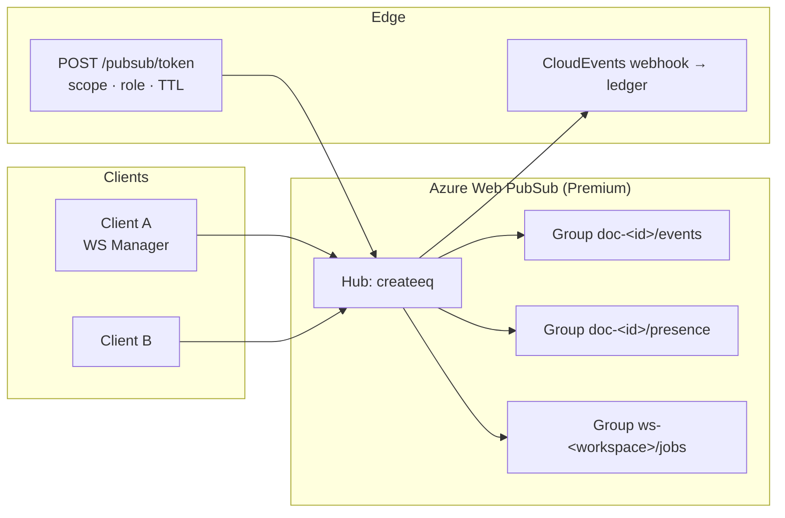
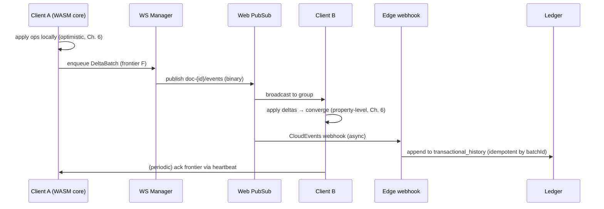

# Chapter 7 — Real-Time Sync & Multi-User Orchestration (Azure Web PubSub)

## 7.1 Transport topology

All realtime transport is **Azure Web PubSub** (spec §2/§7) — managed hub, no self-hosted
WebSocket fleet. The client's WebSocket Manager (Ch. 3) connects through it; the edge
layer never terminates user sockets.



**Connection lifecycle.** The editor authenticates via the normal JWT session, then:

1. `POST /pubsub/token {docId, role: "editor"|"viewer"}` → edge authorizes (workspace
   membership, doc permission, concurrency cap §7.5) → returns a **group-scoped**,
   time-limited hub token (sub = `peerId`, roles = publisher on `doc-{id}/events` +
   `presence`, consumer on all three groups).
2. Client opens the hub connection and joins its groups; `peerId` = user id + session
   suffix (one socket per editor tab).
3. On reconnect (network blip, hub failover), the manager re-joins with **last seen
   frontier** (§7.4) — resume, not re-sync.

## 7.2 Channels: transaction vs presence vs jobs

| Channel | Content | Persisted? | Rate |
|---|---|---|---|
| `doc-{id}/events` | CRDT delta frames (transactional edits, spec §2) | Yes — async ledger webhook (§7.6) | bursty, deduped |
| `doc-{id}/presence` | cursor/viewport frames (ephemeral, spec §7) | **Never** | coalesced 20–30 Hz, TTL 5 s |
| `ws-{workspace}/jobs` | AI job progress + completion | No (status itself is persisted, this is the push) | low |

**Envelope (all channels, binary where possible):**

```proto
// frames.proto — protobuf, spec §2 "Protocol Buffer Delta Stream"
message Frame {
  string topic   = 1;  // "events" | "presence" | "jobs"
  string docId   = 2;
  string peerId  = 3;  // sender identity (signed, verified at edge)
  uint64 seq     = 4;  // per-peer monotonically increasing
  string batchId = 5;  // transaction unit (Ch. 6 §6.3)
  oneof payload {
    DeltaBatch deltas = 10;      // events channel — Loro ops
    Presence     presence = 11;  // presence channel
    JobUpdate    job = 12;       // jobs channel
  }
}
message DeltaBatch { repeated bytes op_deltas = 1; string frontier = 2; }
message Presence { float x = 1; float y = 2; uint32 zoom = 3; int64 ts_ms = 4; }
message JobUpdate { string jobId = 1; string state = 2; float progress = 3; string? error = 4; }
```

**Presence frames bypass the database entirely** (spec §7): hub → other replicas' WS
Managers → render overlay. Disconnect = implicit removal (TTL sweep); no cleanup work.

## 7.3 Delta flow (transactional edits)



- **No per-replica acks** on the hot path — correctness comes from frontiers (§7.4).
- Deltas are queued while offline; the manager flushes in order on reconnect (seq per
  peer gives total order per sender).
- The webhook is the spec §2 stage 6 ("transaction ledger storage via webhook") —
  persistence is fully off the interactive path.

## 7.4 Reconciliation: frontiers and heartbeats

- Every replica keeps its **head frontier** (Ch. 6 §6.5) and emits a heartbeat every 5 s
  on the events channel: `{seq, frontier}`.
- A replica that observes a **gap** (its frontier is behind the sender's, or it missed
  heartbeats during a reconnect) fetches `GET /documents/:id/events?since=<frontier>`
  from the ledger and replays the missing deltas through its CRDT layer — the exact
  rebase path already defined in Ch. 3 §3.7.
- Divergence is therefore *self-healing by design*: hub delivery is best-effort; the
  ledger is the source of truth for catch-up; the CRDT makes replay idempotent.

## 7.5 Concurrency cap & degradation ladder (spec §7)

Hard cap: **200 concurrent editors per document**. Enforcement at token issuance: the
edge counts active connections per doc (PubSub REST "count connections by group") and:

| Level | Behavior |
|---|---|
| < 200 | normal — full editing + presence |
| ≥ 200 | new editors admitted **read-only** (viewer role, no publisher rights on events) |
| presence load high (adjacency) | presence engine **disables non-adjacent cursor rendering** (spec §7): only cursors within ~2 viewport widths of mine are drawn; frames still coalesced but dropped at render |
| > 400 sessions (viewers) | presence capped to 20 Hz → 5 Hz; jobs channel unchanged |

The adjacency rule is implemented in the **client render overlay** (a presence consumer
decides draw/no-draw), not in the hub — preserving bandwidth by dropping at the edge of
the pipeline closest to pixels. Metrics drive the thresholds (Ch. 14 autoscaling).

## 7.6 Persistence separation (summary)

| Data | Path | Durability |
|---|---|---|
| Transactional edits | deltas → webhook → ledger (CloudEvents, batchId-idempotent) | Strong (ledger append) |
| AI job state | edge DB (status row) + jobs channel push | Strong |
| Presence | hub only → TTL 5 s | None (by design) |
| Frontier registry | ledger rows (`frontier → ops → snapshot`) | Strong |

No interactive write ever touches the DB on the request path — the editor's latency
budget (16 ms) is independent of storage latency.

## 7.7 Security

- Hub tokens are **per-doc, per-role, TTL-bounded** (default 1 h, renewed on reconnect);
  `peerId` is asserted by the edge, never client-claimed.
- Workspace isolation is enforced at token issuance and again by **group naming**
  (`doc-{id}` groups are unguessable UUIDs; the edge is the only mint).
- WAF/SSL termination at Front Door (Ch. 14); hub traffic stays in Azure backbone.
- Presence frames carry no document content (coordinates only) — no data-leak surface.

## 7.8 Phasing (interface first, transport later)

| Phase | Deliverable |
|---|---|
| P0 | Frame protobuf schemas + WS Manager interface in `core-js` (send/onDelta/onPresence/onJob, reconnect + frontier resume) — no transport; used for local job-progress events |
| P1 | Jobs channel over **SSE** (interim — AI worker pipeline goes live before PubSub); presence/events interfaces remain stubbed |
| P3 | Azure Web PubSub: token mint, hub groups, delta broadcast, presence, reconciliation, cap ladder; delete SSE interim |

The command bus, CRDT layer (Ch. 6), and frame protocol are all transport-agnostic — the
P3 swap is configuration, not architecture.

## 7.9 Implementation order

1. Protobuf frame schemas + WS Manager interface (+ local jobs eventing).
2. SSE jobs channel for the P1 worker pipeline.
3. Hub + token mint + group joins; events channel with frontier reconciliation.
4. Presence channel + adjacency rendering + TTL sweep.
5. Cap ladder + autoscaling hooks (Ch. 14).

**Gates:** two clients converge pixel-identical after 200 randomized concurrent op
streams (Kleppmann cycle-free, Ch. 6); reconnect-with-gap self-heals from the ledger;
presence drops from 200 → 0 frames/sec at the render overlay without touching edit
throughput; token expiry/renew round-trips under 100 ms.

---

© INNOIRA Consulting Services 2026 · CONFIDENTIAL
