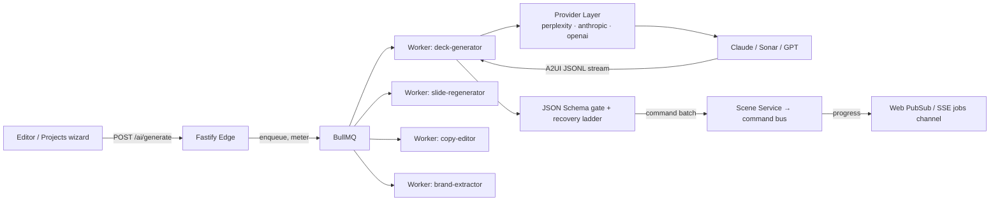
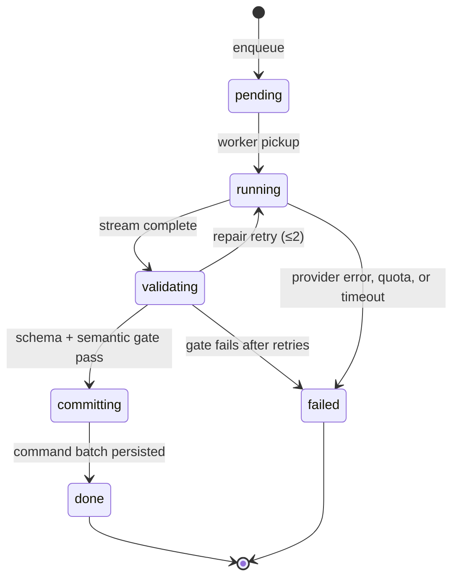

# Chapter 8 — Generative AI Pipeline (A2UI Protocol)

## 8.1 Pipeline shape

All LLM work runs as **queue-backed jobs** — never inline in request handlers (spec §2):



Worker pool = the suite's **shared agent runtime**: agents are config rows (`{name,
persona, tools, routing_rules, model, budget}`), not services; token/cost metering is
per workspace/agent (existing `token_usage_log`); credits/quota gates stay in the billing
layer. This chapter documents the protocol and validation contract the workers share.

## 8.2 Provider layer (as built, 2026-07)

The shared `_llm_chat` layer routes one call to three providers behind one signature:

| Provider | SDK path | Env key | Model default |
|---|---|---|---|
| perplexity | `openai.AsyncOpenAI(base_url=api.perplexity.ai)` | `PERPLEXITY_API_KEY` | `sonar-pro` |
| anthropic | `anthropic.AsyncAnthropic` | `ANTHROPIC_API_KEY` | `claude-sonnet-4-6` |
| openai | `openai.AsyncOpenAI` | `OPENAI_API_KEY` | `gpt-4o-mini` |

- **Resolution**: explicit `provider=` param → `LLM_PROVIDER` env (`auto|perplexity|anthropic|openai`) → auto (Perplexity → Anthropic → OpenAI). `LLM_BASE_URL` overrides for OpenAI-compatible gateways.
- **Cross-cutting (all providers)**: 3 attempts with `2^attempt` backoff on rate limits; daily-quota gate (`_rate_ok`) when a user context is present; usage metering into `token_usage_log`; credits charged per action by the caller (e.g. `carousel_generate`).
- **Per-task routing** (config, not code): the target model is data — tasks needing JSON discipline may pin `gpt-4o-mini`-class models, long-form generation pins reasoning-capable models; the editor/AI pipeline never hardcodes a model name outside config.

**Migrate-on-reload rule**: `LLM_PROVIDER` on Azure decides the fleet default; a provider outage is a *config flip + reload*, never a code change.

## 8.3 A2UI protocol (v0.9 surface)

**A2UI = Agent-to-UI JSONL streaming.** The worker sends the agent a task envelope; the
agent replies with a stream of JSONL frames; the worker reassembles, validates, and
commits. Frame model:

```ts
// frame stream (JSONL, one JSON object per line)
type Frame =
  | { kind: "begin"; task: string; taskId: string; schemaVersion: "0.9" }
  | { kind: "delta"; seq: number; patch: unknown }        // partial result chunk
  | { kind: "command"; batchId: string; commands: Command[] } // final commit set
  | { kind: "error"; code: string; message: string; recoverable: boolean };

// task envelope (request)
interface Task {
  taskId: string; task: string;            // deck.generate | slide.regenerate |
                                           // copy.rewrite | asset.select |
                                           // brand.extract | layout.solve
  context: { doc?: SceneView; brief?: string; prompt?: string; tokens?: ThemeView };
  constraints: { schema: JSONSchema; maxTokens?: number; style?: "json" | "jsonl" };
}
```

**Why JSONL (spec §8):** the stream is resumable at line granularity — a truncated frame
is recoverable without replaying the task; progress lands in the editor as deltas arrive
(`job.progress` on the jobs channel, Ch. 7) instead of after a full blocking generation.

**WasmGC** is a client-runtime requirement tied to the WASM core (Ch. 3): the A2UI frame
parser and the CRDT layer run in WasmGC-compiled code so per-frame garbage is collected by
the engine's GC, not the JS GC — relevant at high frame rates (spreadsheets/large decks);
irrelevant while the core is TS, noted here so the WASM phase (P2) doesn't regress it.

## 8.4 Structured-output gate

Every task declares a **JSON Schema**; the worker validates the agent's output *before*
anything touches the scene:

1. **Parse** — streaming line-accumulator; on truncation run the repair state machine (8.5).
2. **Validate** — schema check (types, required fields, enums like `kind: hook|body|cta`,
   count constraints like `slides.length == N`).
3. **Semantic gate** — constraint resolution: token references resolvable (8.6), element
   types registered (8.7), tree acyclic (8.8), geometry within canvas bounds.
4. **Commit** — a valid result becomes one batched command transaction (`batchId`, one
   undo unit per Ch. 3/6); an invalid result triggers **repair retry** (≤2) with the
   schema errors fed back to the agent, then a clean `failed` state — never a partial deck.

**Current-state bridge:** the existing `_extract_json` + `_fix_json` state-machine repair
(server.py) is the P0 implementation of steps 1–2 for strict-JSON tasks; the semantic gate
is the missing piece this chapter adds.

## 8.5 Recovery ladder (spec §8, exact semantics)

| Parse failure state | System action | Safety fallback |
|---|---|---|
| Incomplete JSON tags (unclosed brackets) | Stream parser closes brackets **in memory** (existing `_walk_and_fix` state machine) | Defaults applied to missing fields |
| Invalid component maps (unknown element type) | Warning logged; widget replaced | Standard frame with the default props of the registered base type |
| Missing design tokens | Warning in agent mode; silent resolve for humans | **Root theme fallback token** (Ch. 5 §5.8 resolution chain) |
| Circular tree references (parent self/child cycle) | Kleppmann cycle-free solver (Ch. 6 §6.4) | Cycle broken; node re-attached to root |

All four fallbacks are **deterministic** — the same inputs yield the same deck on every
provider — which is what makes regeneration reproducible and testable.

## 8.6 Task catalog (v1)

| Task | Input | Output contract | Existing endpoint |
|---|---|---|---|
| `deck.generate` | topic, platform, slide_count, tone, brand | `{slides:[{kind,title,subtitle,body,cta}]}` + layout hints | `/carousel/generate` |
| `slide.regenerate` | one slide + instruction | same slide shape, kind preserved | `/carousel/edit` |
| `copy.rewrite` | selected text + mode (punchier/shorter/catchier/formal) | `{title}` rewrite | `/carousel/edit` |
| `brand.extract` | website snippet | `{bg,accent,text,font,logo_text}` | `/carousel/brand-from-url` |
| `asset.select` | slide content | search terms for stock photos | `/carousel/asset-search` |
| `layout.solve` | absolute elements | flex structure (Ch. 9) | — (Phase 2) |

Image generation stays on its own per-call path (`/carousel/ai-image`, gpt-image-1 /
nano-banana, metered per image via `record_image_usage`) — it is not an A2UI text task.

## 8.7 Job lifecycle & UX contract



- Progress: `GET /jobs/:jobId` (poll) + jobs channel push (Ch. 7). The editor shows an
  inline progress pill with the batch preview; on `done`, the batch lands on the command
  bus (undoable as one unit) — the Cursor-style review moment.
- Timeouts: per-task max duration (e.g. deck.generate 120 s); kill + repair retry; then failed.
- Quota/credit errors short-circuit **before** any LLM call (no metered spend on a
  customer who can't be billed).

## 8.8 Implementation order

1. **P0 (now)**: semantic gate + schema validation wrapped around the existing
   `_llm_chat`/`_extract_json` calls in the carousel endpoints (provider layer already
   live); model/config as env data (`LLM_PROVIDER`, `*_MODEL`).
2. **P1**: move the five task types onto BullMQ workers; add job lifecycle rows +
   `GET /jobs/:jobId`; SSE progress channel; repair-retry loop; per-task JSON Schemas in
   a `task_schemas/` module; switch carousel endpoints to enqueue.
3. **P2**: A2UI JSONL streaming end-to-end (stream parser + WasmGC path in the WASM core);
   `layout.solve` task; constraint solver integration (Ch. 9).

**Gates:** provider parity — every task validates against its schema on all three
providers; repair path unit-tested on a corpus of deliberately malformed outputs (truncated
JSON, unknown widgets, bad tokens, cycles); job lifecycle survives worker restart (BullMQ
retry + at-least-once with `batchId` idempotency); regeneration determinism test (same
input + same frontier → same commit or a marked failure, never a divergent partial deck).

---

© INNOIRA Consulting Services 2026 · CONFIDENTIAL
