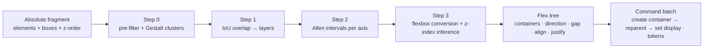

# Chapter 9 — Layout Detection Engine (Absolute → Flex)

## 9.1 Purpose

Today's AI generation emits absolute coordinates; the spec's core directive (Ch. 1)
requires **responsive structures rather than absolute coordinates**. This engine is the
reverse-engineering pass (spec §9) that compiles absolute scene fragments into flex trees —
turning "deck at 1080×1350" into "deck that reflows to any size, any theme, any brand
spacing".



Runs in two places: automatically after `deck.generate` in the AI pipeline (Ch. 8
`layout.solve` task), and as an explicit editor command ("Convert to flexible layout")
on any selection. Both produce the same **deterministic** output.

## 9.2 Input/output contract

```ts
interface LayoutSolveIn {
  elements: LayoutEl[];       // { id, kind, box: {x,y,w,h}, zIndex: FractionalIndex,
                              //   props: { fill?, fontSize?, fontFamily?, text? } }
  canvas: { w: number; h: number };
  options?: { targetGap?: number };  // prefer a token-aligned gap
}
interface LayoutSolveOut {
  tree: FlexNode[];           // containers + children; children carry optional
                              // relative offsets only where not flex-positioned
  zLayers: { layerId: string; elementIds: string[]; order: number }[];
  warnings: string[];         // non-converted (kept absolute) elements
}
```

Rules: output is **lossless** (original boxes reconstructible from the tree + gaps, within
1 px); elements that don't participate in any linear structure (decorative shapes,
backgrounds) stay absolute and are listed in `warnings`.

## 9.3 Step 0 — Pre-filtering (homogeneity + Gestalt)

1. **Homogeneity check** — classify each element as *layout* or *decoration*:
   - full-bleed elements (box ≈ canvas, or role `background`) → decoration, excluded
   - `fill` ≈ slide background color (color-distance < ε) with alpha < 0.15 → decoration
   - large shapes with no text/children → decoration
   - everything else → layout candidate
2. **Gestalt pre-clustering** — group candidates by similarity and proximity:
   - shared edges (aligned lefts/rights/tops/bottoms within 2 px)
   - shared style (same font family+size bucket, same fill token)
   - proximity (gap < 2× median font size)
   - continuation (chains where each element overlaps the next along one axis)
   Clusters are the working units for steps 1–2 — never individual elements.

## 9.4 Step 1 — Overlap evaluation (IoU)

For every pair within a cluster:

```
IoU(A, B) = Area(A ∩ B) / Area(A ∪ B)
```

| IoU | Decision |
|---|---|
| `> 0.1` | same **layered group** (stacked — spec threshold) |
| `≤ 0.1` | independent siblings (candidates for a linear series) |
| `≈ 0` and disjoint | definitely linear siblings |

Layered groups become stacking candidates; their members are excluded from linear-series
tests (a text-over-card badge is a layer, not a column item). The threshold is a
constant (spec §9) and must stay a named constant in code — it is a tuned product
parameter, not an ad-hoc number.

## 9.5 Step 2 — Interval mapping (Allen's interval algebra)

Each element maps to intervals per axis: `Ix = [left, right]`, `Iy = [top, bottom]`.
Allen's 13 relations are evaluated along the **dominant axis** of each cluster:

| Relation (a vs b) | Interval condition | Meaning |
|---|---|---|
| before / meets | `a.right ≤ b.left` (meets: equal) | linear order candidate |
| overlaps | partial intersection | possible gap or layer |
| starts / during / finishes | containment | nesting candidate |
| equals | identical bounds | layered group |

1. **Dominant axis** per cluster: compare summed pairwise distances along x vs y — the
   larger sum is the reading axis (row for x, column for y). Text stacks are columns;
   bullet lists are columns; side-by-side stat cards are rows.
2. **Series detection**: the longest chain of `before`/`meets` relations along the dominant
   axis (allowing one skipped gap for variance) = a linear series.
3. **Nesting**: containers (`starts`/`during`) become inner flex children of outer series
   (a column of rows: stat cards each an inner row).

## 9.6 Step 3 — Flexbox conversion

Per linear series, emit a container:

```ts
{
  id: newId(), type: "group", display: "flex",
  props: {
    direction: dominantAxis === "x" ? "row" : "column",
    gap: tokenizeGap(median observed gap),   // → $spacing.* (nearest token)
    align: inferAlign(elements),             // start|center|end|stretch — from
                                             // edge-alignment statistics
    justify: inferJustify(elements),         // start|center|end|between|evenly —
                                             // from leftover-space distribution
    padding: toCanvasEdge(elements),         // margins to canvas edges → $spacing.*
  },
  children: [element ids …],
}
```

- Children lose `x/y` (flex positions them); **relative offsets** are kept only for
  exceptions (e.g. a child translated for an intentional nudge) as `transform` — never
  absolute boxes.
- `gap`/`padding` round to the nearest spacing token (Ch. 5 §5.8) so themes can re-tune
  rhythm globally; the ≤1 px round-trip guarantee makes this lossless in practice.
- **Z-index inference** (spec §9): layered groups (Step 1) order by the *original
  fractionalIndex* — later elements paint above; the resulting `zLayers` order is written
  explicitly so flex rendering doesn't depend on array order (Ch. 5).

## 9.7 Determinism & evaluation gates

The engine is a pure function — same input → same tree (required for Ch. 8 provider
parity and regeneration tests). Acceptance gates:

1. **Round-trip fidelity**: render the flex tree at the original canvas size vs. the
   original absolute layout — pixel diff ≤ 0.5% on the golden deck corpus (all 15 element
   types, mockups, panorama).
2. **Reflow preservation**: shrink canvas 1080×1350 → 1080×1080; flex tree reflows with
   no element overlapping outside its container by > 2 px; decoration stays pinned.
3. **Conversion ratio**: ≥ 80% of layout elements in AI-generated decks convert to flex
   containers (remaining = genuine free-form decoration, surfaced in `warnings`).
4. **Determinism**: property-based test — random absolute layouts, two runs, identical
   trees.

## 9.8 Phasing

- **P1**: `layout.solve` as a local deterministic function in `core-js` (pure TS, runs
  on the editor's "Convert to flexible layout" command); no AI involvement yet.
- **P2**: wired into the AI pipeline after `deck.generate` (Ch. 8 task catalog);
  constraints solver integration (canvas bounds, min gap) as a post-pass.
- Flex rendering lands with Ch. 5 `display: flex` + the layout solver in `core-wasm`
  (Ch. 3/4) — the detection engine's output tree is the input contract of that solver,
  so both sides are testable independently before the WASM phase.

## 9.9 Implementation order

1. Interval math + dominant-axis detection (pure functions, unit-tested on synthetic
   series: rows, columns, nested cards, layered badges).
2. IoU layering + Gestalt clustering.
3. Flex-tree emit + token rounding + `zLayers`.
4. Editor command + round-trip gates on the golden corpus.
5. AI pipeline integration (`layout.solve` task, P2).

**Success gates:** §9.7 1–4; conversion is undoable as one command batch (Ch. 3
`batchId`); saved decks that were converted re-hydrate byte-identical (Ch. 5 hydrator).

---

© INNOIRA Consulting Services 2026 · CONFIDENTIAL
