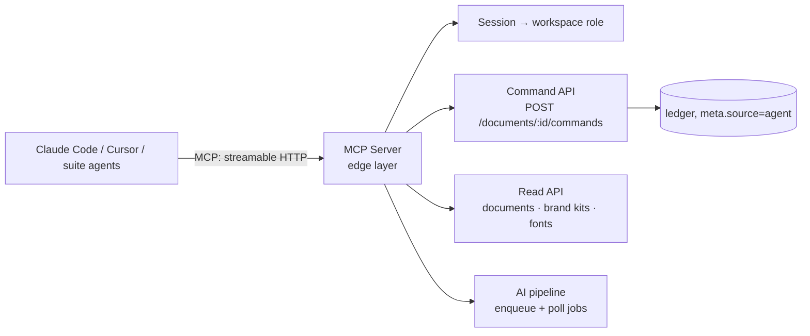

# Chapter 10 — MCP Integration (Agent Tool Access)

## 10.1 Why MCP

Spec §1's Agent Interface dimension: agents (Claude Code, Cursor, future suite agents)
act through **direct protocol access**, not screenshot processing. The MCP server gives
external agents structured, schema-validated access to the document — eliminating the
hallucinated-coordinate class of failure that comes from agents *looking at pixels*:

- **No visual parsing** — agents read the scene as data (tokens, boxes, z-order) and
  emit typed commands. 100% design-token compliance becomes testable, not hoped for.
- **One mutation pipeline** — MCP tools are thin wrappers over the **command API**
  (Ch. 3). An agent edit is indistinguishable, in the ledger, from a human edit
  (`meta.source: "agent"`, `agentId` recorded for metering/audit).

## 10.2 Architecture & transports

| Concern | Decision |
|---|---|
| Transport | **streamable HTTP** (modern MCP default; stdio for local/dev usage) |
| Implementation | P0: Python MCP SDK alongside FastAPI (wraps existing handlers); P1: Fastify MCP server (TS SDK) |
| Auth | MCP session bound to a workspace user JWT (same token the editor uses); per-session scopes |
| Tool→API mapping | 1:1 with HTTP endpoints; MCP never reaches the scene directly |

## 10.3 Tool registry (v1)

Read tools (data, schema-validated):

| Tool | Returns |
|---|---|
| `list_documents` / `get_document` | deck list / scene graph + head frontier |
| `get_slide` / `get_element` | one slide / one node (typed props, tokens unresolved → raw refs) |
| `list_brand_kits` / `get_brand_kit` | kits incl. tokens, logo, position/size |
| `list_palettes` / `list_fonts` | token catalogs (PALETTES + Google Fonts manifest) |
| `resolve_token` | token ref → resolved value (with fallback chain path, Ch. 5 §5.8) |

Write tools (all emit commands):

| Tool | Command batch |
|---|---|
| `apply_command(command)` | single command (node.set, node.transform, …) |
| `apply_batch(commands, batchId?)` | atomic transaction (undoable as one unit) |
| `generate_deck(brief, opts)` | enqueue `deck.generate` job; returns jobId |
| `restyle_slide(index, style, brand?)` | `tokens.apply` + node.set batch |
| `convert_to_flex(selection)` | `layout.solve` (Ch. 9) as a command batch |
| `export_document(format)` | export job (Ch. 13) → artifact URL |

**Progress**: AI jobs surface via MCP **notifications** (server → agent) and
`get_job(jobId)` polling; agents can await completion before further commands — the same
job lifecycle as the editor (Ch. 8 §8.7).

## 10.4 Compliance guarantees

1. **Token discipline**: agents receive *unresolved* refs (`$color.text`) and use
   `resolve_token`; a command referencing an unknown token fails validation with the
   root-theme fallback resolution included in the error (deterministic, Ch. 5/8).
2. **Schema gate**: every tool response and every accepted command passes the same zod /
   JSON Schema validators as the editor (Ch. 3 `validateCommand`, Ch. 8 gate) — an agent
   cannot inject malformed structure by construction.
3. **Cycle safety**: reparent commands from agents hit the same Kleppmann solver as human
   moves (Ch. 6 §6.4) — the AI-repair path and the MCP path converge on one algorithm.
4. **Bounds**: geometry outside canvas is rejected with a normalized error the agent can
   recover from (retry with corrected payload), not silently clamped.

## 10.5 Security & audit

- **No code execution**: MCP exposes tools only — no arbitrary tool-injection, no shell.
- **Scoped sessions**: token binds workspace + role; read-only role for viewers (mirrors
  Ch. 7 role model); per-tool allowlist configurable per agent.
- **Audit by construction**: every write lands in the command ledger with
  `meta.source: "agent"`, `agentId`, and the session's user — agent activity is
  replayable and attributable (Ch. 6 ledger is the audit trail).
- **Rate & cost**: agent sessions share the workspace quota/credit gates (Ch. 8); a
  runaway agent loop costs credits, not unbounded LLM spend.
- **Prompt-injection posture**: document content provided to agents is data, not
  instructions — system prompt declares the boundary; commands are validated against
  schemas regardless of content.

## 10.6 Current-state bridge (P0)

Before the Fastify/command-API world lands, ship the MCP server against today's stack:

1. Python MCP SDK server (`backend/mcp_server.py`) with the read tools wired to the
   existing Mongo-backed handlers and write tools wired to the current REST endpoint
   semantics (carousel CRUD + AI endpoints).
2. Session auth = `Authorization: Bearer <JWT>` on the MCP HTTP transport (reuse
   `current_user` dependency logic).
3. Local dev: `mcp dev mcp_server.py` or stdio mode; tests via the MCP Python client
   session (`mcp.client.session.ClientSession`) — tool contract tests as unit tests.
4. P1: port to the Fastify MCP server behind the command API; **the tool surface stays
   identical** — agents' integrations are stable across the migration.

## 10.7 Implementation order & gates

1. Read tools + auth + contract tests.
2. Write tools via command batches + ledger attribution.
3. Job tools + notifications (depends on Ch. 8 job lifecycle).
4. `convert_to_flex` + export tools (depends on Ch. 9, 13).
5. Fastify port (P1) with identical tool surface.

**Gates:** every tool passes schema-validated round-trip tests (MCP client session);
agent-generated batches are undoable in the editor exactly like human edits; an end-to-end
test — "Claude Code generates a 6-slide deck from a brief via MCP, human undoes one AI
batch, redo works" — passes; no tool bypasses the ledger (write-path audit check).

---

© INNOIRA Consulting Services 2026 · CONFIDENTIAL
