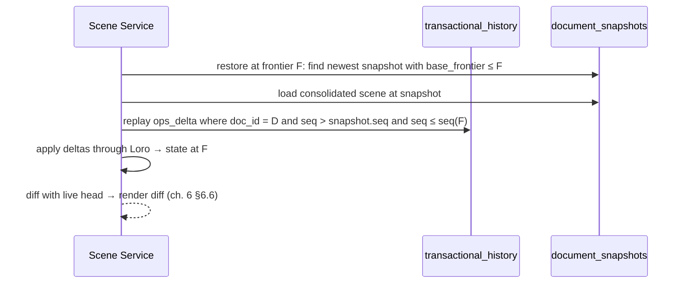

# Chapter 11 — Persistence Layer (Postgres Hybrid)

## 11.1 Storage split (spec §11)

| Concern | Store | Why |
|---|---|---|
| Identity, permissions, metadata | Relational tables | Joins, constraints, RBAC, tenancy |
| Document scene (nodes) | `document_nodes` JSONB rows + indexed position params | O(1) node ops, per-node dirty writes, flat-map model (Ch. 5) |
| Command/op history | `transactional_history` with compressed binary `operations_delta` (Loro/Yjs updates) | Point-in-time recovery, undo-across-reloads, audit |
| Assets (bytes) | Blob Storage + CDN; PG holds metadata only | Cost, latency |
| AI jobs, metering, brand kits, themes | Relational + JSONB | Queryability, tenant scoping |
| Embeddings (future KB, suite pgvector requirement) | `pgvector` columns | Shared KB layer |

Write path principle (spec §2 stage 6): interactive writes are **deltas appended async
via the CloudEvents webhook**; the read path is the consolidated snapshot + replay. The DB
is never on the editor's interactive latency path.

## 11.2 Schema (DDL, v1)

```sql
-- identity & tenancy (suite-wide shared runtime shape)
CREATE TABLE workspaces (
  id uuid PRIMARY KEY, name text NOT NULL,
  plan text NOT NULL DEFAULT 'trial', created_at timestamptz NOT NULL DEFAULT now()
);
CREATE TABLE users (
  id uuid PRIMARY KEY, workspace_id uuid NOT NULL REFERENCES workspaces(id),
  email text NOT NULL UNIQUE, role text NOT NULL DEFAULT 'member',
  created_at timestamptz NOT NULL DEFAULT now()
);
CREATE INDEX idx_users_workspace ON users(workspace_id);

-- documents: metadata + consolidated state (head frontier, brand, theme)
CREATE TABLE documents (
  id uuid PRIMARY KEY,
  workspace_id uuid NOT NULL REFERENCES workspaces(id),
  title text NOT NULL, platform text NOT NULL DEFAULT 'linkedin',
  theme_id uuid, brand_id uuid,
  head_frontier text NOT NULL,            -- ch. 6 §6.5
  schema_version int NOT NULL DEFAULT 1,
  status text NOT NULL DEFAULT 'active',  -- active | archived | deleted
  created_at timestamptz NOT NULL DEFAULT now(),
  updated_at timestamptz NOT NULL DEFAULT now()
);
CREATE INDEX idx_documents_workspace ON documents(workspace_id, updated_at DESC);

-- nodes: flat map per document (ch. 5 §5.3) — JSONB props + indexed position params
CREATE TABLE document_nodes (
  node_id uuid PRIMARY KEY,
  doc_id uuid NOT NULL REFERENCES documents(id) ON DELETE CASCADE,
  parent_id uuid NULL REFERENCES document_nodes(node_id) ON DELETE SET NULL,
  node_type text NOT NULL,                -- slide | text | image | shape | group | …
  z_index text NOT NULL,                  -- fractionalIndex (hex string, sortable)
  props jsonb NOT NULL,                   -- typed props + tokens (ch. 5)
  deleted boolean NOT NULL DEFAULT false, -- tombstone for CRDT delete
  created_at timestamptz NOT NULL DEFAULT now()
);
CREATE INDEX idx_nodes_doc_parent ON document_nodes(doc_id, parent_id, z_index);
CREATE INDEX idx_nodes_props ON document_nodes USING gin (props jsonb_path_ops);

-- transactional_history: the command/op ledger (spec §11)
CREATE TABLE transactional_history (
  id bigint GENERATED ALWAYS AS IDENTITY PRIMARY KEY,
  doc_id uuid NOT NULL REFERENCES documents(id) ON DELETE CASCADE,
  client_id text NOT NULL,                -- idempotency key (ch. 3 §3.7)
  batch_id text NOT NULL,                 -- undo unit (ch. 3 §3.6)
  seq int NOT NULL,                       -- per-document monotonic
  frontier text NOT NULL,                 -- boundary hash (ch. 6 §6.5)
  ops_delta bytea NOT NULL,               -- zstd-compressed Loro/Yjs binary updates
  meta jsonb NOT NULL DEFAULT '{}',       -- source: user|agent, agentId, audit
  created_at timestamptz NOT NULL DEFAULT now(),
  UNIQUE (doc_id, client_id)
);
CREATE INDEX idx_ledger_doc_seq ON transactional_history(doc_id, seq);
CREATE INDEX idx_ledger_frontier ON transactional_history(doc_id, frontier);

-- consolidation: snapshot + base frontier (ch. 6 §6.7)
CREATE TABLE document_snapshots (
  doc_id uuid NOT NULL REFERENCES documents(id) ON DELETE CASCADE,
  frontier text NOT NULL,
  scene jsonb NOT NULL,                   -- consolidated node state at frontier
  base_frontier text NOT NULL,            -- delta chain base
  created_at timestamptz NOT NULL DEFAULT now(),
  PRIMARY KEY (doc_id, frontier)
);

-- brand kits & themes (tokens as data, ch. 5 §5.8)
CREATE TABLE brand_kits (
  id uuid PRIMARY KEY, workspace_id uuid NOT NULL REFERENCES workspaces(id),
  name text NOT NULL, logo_url text NOT NULL DEFAULT '',
  colors jsonb NOT NULL DEFAULT '[]', fonts jsonb NOT NULL DEFAULT '[]',
  palette_id text, logo_size text NOT NULL DEFAULT 'l',
  logo_position text NOT NULL DEFAULT 'bl',
  created_at timestamptz NOT NULL DEFAULT now()
);
CREATE TABLE themes (
  id uuid PRIMARY KEY, workspace_id uuid REFERENCES workspaces(id),
  name text NOT NULL, tokens jsonb NOT NULL  -- DTCG token pack
);

-- assets (bytes in Blob; this is metadata)
CREATE TABLE assets (
  id uuid PRIMARY KEY, workspace_id uuid NOT NULL REFERENCES workspaces(id),
  storage_key text NOT NULL, mime_type text NOT NULL,
  size_bytes bigint NOT NULL, checksum text,
  created_by uuid REFERENCES users(id), created_at timestamptz NOT NULL DEFAULT now()
);

-- AI jobs (ch. 8 §8.7)
CREATE TABLE ai_jobs (
  id uuid PRIMARY KEY, workspace_id uuid NOT NULL REFERENCES workspaces(id),
  task text NOT NULL, state text NOT NULL DEFAULT 'pending',
  provider text, model text,
  progress numeric(4,3) NOT NULL DEFAULT 0,
  error jsonb, started_at timestamptz, finished_at timestamptz,
  created_at timestamptz NOT NULL DEFAULT now()
);
CREATE INDEX idx_jobs_workspace ON ai_jobs(workspace_id, created_at DESC);

-- token usage metering (existing Mongo shape → relational, suite-wide)
CREATE TABLE token_usage_log (
  id uuid PRIMARY KEY, workspace_id uuid NOT NULL REFERENCES workspaces(id),
  user_id uuid NULL REFERENCES users(id), model text NOT NULL,
  agent text, action text,
  input_tokens int NOT NULL DEFAULT 0, output_tokens int NOT NULL DEFAULT 0,
  cost_usd numeric(10,6) NOT NULL DEFAULT 0, at timestamptz NOT NULL DEFAULT now()
);
CREATE INDEX idx_usage_ws ON token_usage_log(workspace_id, at DESC);
```

Key decisions:

- **`client_id` unique** — the webhook is at-least-once; the unique constraint makes it
  exactly-once (Ch. 3/7 idempotency).
- **Nodes are rows, not one giant JSONB blob** — per-node dirty writes match delta-based
  sync (Ch. 6), and `(doc_id, parent_id, z_index)` makes reorder/reparent O(1) with an
  index instead of a document rewrite.
- **Tombstones** — `deleted` flag keeps CRDT delete semantics; compaction removes them.
- **`document_snapshots`** — the consolidation target; recovery = base snapshot + replay
  of deltas `WHERE seq > snapshot.seq` (spec §11 exact semantics, Ch. 6 §6.7).
- **Tenancy everywhere** — every table carries `workspace_id`; row-level policies or app
  scoping enforced uniformly (Ch. 14 security).

## 11.3 Point-in-time recovery (spec §11)



Recovery cost is bounded by delta volume since the last consolidation, not document age.
Consolidation triggers (Ch. 6 §6.7): 10k ops / 24 h active / manual pre-export.

## 11.4 Assets & exports

- Bytes: Blob (`assets/{workspace}/{id}`), CDN fronted; `image_url` tokens stay
  short-lived (`?t=access_token`) exactly like today's `carousel_images` serving
  (server.py) until the CDN-signed-URL model replaces them.
- Exports (Ch. 13): artifact registry — `exports` table (job → format → storage key →
  signed download URL); no DB storage of image bytes.

## 11.5 MongoDB → Postgres migration

| Mongo collection | Postgres target | Notes |
|---|---|---|
| `workspaces`, `users` | `workspaces`, `users` | identity + roles |
| `carousels` (doc JSON) | `documents` + `document_nodes` | the big transform: slides/elements → node rows; hydrator v0→v1 (Ch. 5) does the shape mapping; keep `_id`-style legacy ids as uuid v5 from old ids for continuity |
| `brandkits` | `brand_kits` | direct (fields already flat) |
| `carousel_images` | Blob + `assets` | bytes → Blob, metadata → PG; rewrite `image_url` refs in decks |
| `token_usage_log` | `token_usage_log` | direct |
| `uploaded_images` + other suite collections | Blob + `assets` | same pattern |

Migration mechanics:

1. **Dual-write** (new writes go to PG while reads still hit Mongo) is *not* the move
   here — this is a single-tenant-per-workspace doc store. Instead: **snapshot migrate**
   per workspace at first login, backfill in background jobs, feature-flag by workspace.
2. **Order**: identity → brand kits → documents (hydrated) → images → usage. Documents
   are migrated last-read-first-written to minimize replay window.
3. **Idempotent**: migration jobs record a `migrations` watermark table; re-runs skip
   done workspaces. UUIDs derived deterministically from Mongo ids so foreign keys stay
   stable across the cutover.
4. **Rollback**: keep Mongo read-only for 14 days post-migration; compare frontier
   hashes per document (Ch. 6) — hash equality proves parity without pixel diffing.

## 11.6 pgvector (suite KB layer)

`document_nodes.props` is not the embedding home. A separate `kb_chunks` table
(`workspace_id, agent, source_id, content, embedding vector(1536)`) serves the shared
KB/vector store the suite needs (ReplyEQ/Eva knowledge bases later) — CreateEQ writes
deck-summary embeddings into it so future agents can search past decks. Created in the
same migration wave; not on CreateEQ's hot path.

## 11.7 Implementation order & gates

1. DDL + Flyway-style migrations in the shared runtime repo; idempotent upserts.
2. Webhook → ledger append with `client_id` dedupe; consolidation job (zstd deltas).
3. Read path: documents + nodes hydration (Ch. 5 hydrator reused server-side).
4. Brand kits, assets, jobs, usage tables; cutover per workspace with rollback window.
5. pgvector KB table.

**Gates:** frontier-hash parity per document (Mongo vs PG) for the golden corpus;
recovery from any frontier ≤ 5 s on a 100-slide doc; ledger append dedupes 100% on
webhook redelivery; cutover rollback executes cleanly (read-only Mongo, no data loss).

---

© INNOIRA Consulting Services 2026 · CONFIDENTIAL
