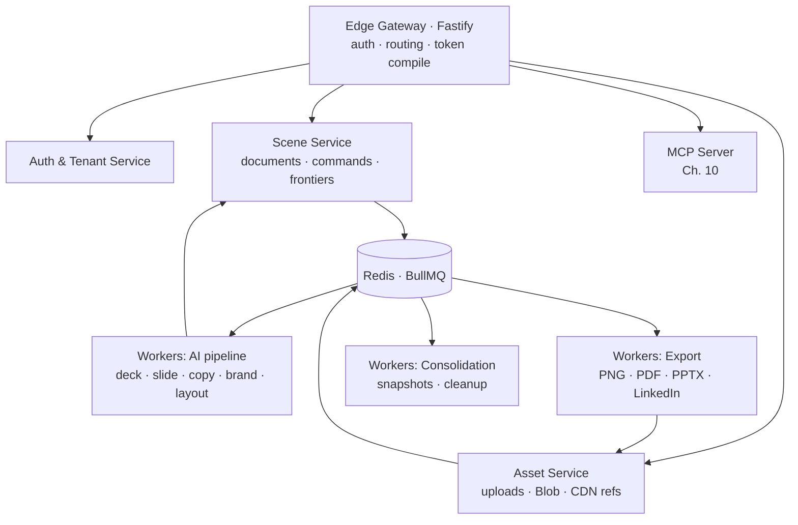
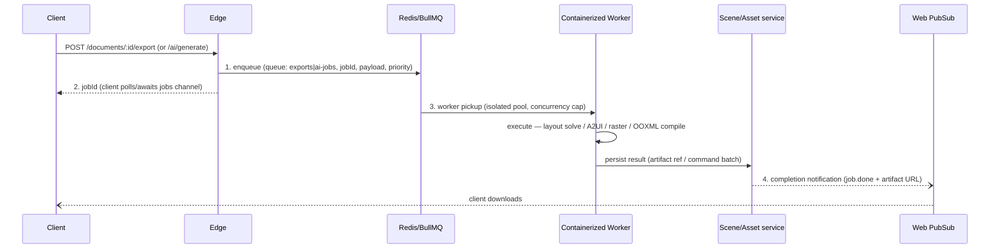

# Chapter 12 — Backend Microservices (Fastify & BullMQ)

## 12.1 Service topology

Stateless Fastify services behind the edge gateway; heavy work offloaded to
Redis/BullMQ workers (spec §12):

**Statelessness rules:** no in-session state in service memory; no local filesystem
(Blob everywhere); every request re-derives identity from the JWT; each service is a
pure function of (request, DB, queue). Horizontal scaling is therefore trivial — the
only stateful components are Postgres and Redis.

**Suite pattern:** these are consumers of the shared agent runtime (auth/tenant,
queue, metering) — CreateEQ does not build its own auth or metering (CLAUDE.md shared
runtime requirement).

## 12.2 Service boundaries & contracts

| Service | Owns | API surface (high level) |
|---|---|---|
| Auth & Tenant | users, workspaces, roles, sessions | `/auth/*`, `/tenants/*` |
| Scene | documents, nodes, ledger, frontiers | `/documents/*`, `/documents/:id/commands`, `/documents/:id/events` |
| Asset | uploads, Blob refs, CDN | `/assets`, `/assets/:id` |
| MCP | agent tool surface (Ch. 10) | MCP streamable HTTP |
| AI pipeline (workers) | task execution, A2UI, validation | consumed via queue; no public surface |
| Export (workers) | render + compile | consumed via queue; artifact refs in `/exports` |
| Consolidation (workers) | snapshots, retention | scheduled; no public surface |

Contracts between services: **HTTP (edge → service) + queue (service → worker) + ledger
(worker → scene)**. Workers never expose HTTP; completion signals travel on the jobs
channel (Ch. 7) and artifact refs return through the scene/asset services.

## 12.3 The four-step job pipeline (spec §12, exact)

1. **Enqueue**: `{jobId, task, docId, payload, priority, attempts, backoff}` — workspace
   scoped, metered at enqueue (credit pre-check, Ch. 8).
2. **Worker isolation**: dedicated container pools per queue family with per-pool CPU/
   memory profiles — AI workers (GPU-less, token-bounded) vs. export workers
   (rasterization, memory-bounded). Concurrency per worker (e.g. 4 AI / 2 export) to
   keep tail latency bounded.
3. **Execution**: pure functions of (job, DB, queue); no shared mutable state; retryable.
4. **Notification**: result → scene/asset services → Web PubSub jobs channel (Ch. 7) →
   client. Also persisted as `ai_jobs`/`exports` rows for late pollers.

## 12.4 BullMQ queue topology

| Queue | Payload shape | Retry/backoff | DLQ |
|---|---|---|---|
| `ai-jobs` | task + context + schema version | 3 attempts, `2^attempt` exponential | `ai-jobs:dead` (investigate, replay) |
| `exports` | docId, format, quality | 2 attempts, fixed 30 s | `exports:dead` |
| `assets` (processing) | upload → variant generation (thumbnails) | 3 attempts | `assets:dead` |
| `consolidation` | docId (scheduled) | retry next tick | n/a |

- **Idempotency**: every job carries `jobId`; workers dedupe against `transactional_history.client_id` / `ai_jobs.id` (at-least-once delivery, exactly-once effect, Ch. 11 §11.2).
- **Priority**: interactive AI actions > background consolidation; implemented via queue
  priority + per-queue worker pools (never priority inside one pool — starves tail).
- **Scheduling**: consolidation/retention as recurring jobs in a dedicated `scheduler`
  worker (BullMQ repeatables).
- **Observability**: job state transitions emitted as structured logs + metrics
  (queue depth, age, failure rate) — App Insights (Ch. 14); queue depth doubles as the
  worker autoscale trigger.

## 12.5 Fastify engineering conventions

- **Plugin composition**: one Fastify instance per service = chain of plugins (auth,
  routes, validation, telemetry); services share a `platform` plugin (JWT verify,
  tenant scoping, error envelope, request id).
- **Typed routes**: TS schema-first (`@fastify/type-provider-typebox`); JSON Schema
  validation on every route — same schemas as the client command bus (Ch. 3) and MCP
  tools (Ch. 10), so validation is one source of truth across HTTP/MCP/queue.
- **Health/readiness**: `/health` (liveness) + `/ready` (PG + Redis connectivity) on
  every service; App Service probes use these (Ch. 14).
- **Graceful shutdown**: SIGTERM → stop accepting → drain in-flight jobs (BullMQ
  `close()` with timeout) → flush telemetry; no dropped ledger appends.
- **Connection pooling**: one pg pool per service (size = concurrency × 2), no unbounded
  connections; Redis reused across queues + cache with prefix per queue family.

## 12.6 Current-state mapping (FastAPI → services)

| Today (`backend/server.py` + modules) | Target service |
|---|---|
| auth/workspace/JWT sections | Auth & Tenant |
| carousel CRUD, brandkits, `/carousel/images*` | Scene (+ Asset for bytes) |
| `/upload-image`, image serving | Asset |
| `_llm_chat` + carousel AI endpoints | AI pipeline workers (queue) |
| PNG/PDF export logic (client-side html2canvas) | Export workers (Ch. 13) |
| webhooks (Airtable/Notion), analytics | Edge + Scene consumers |
| `billing.py`, `token_usage.py` | Shared runtime (unchanged behavior, relational store Ch. 11) |

Port order follows the roadmap (Ch. 0): Scene service first (documents+ledger), then
Asset, then the AI pipeline onto BullMQ, then Export. The FastAPI app remains the
gateway during migration; each extracted service mounts behind it (path-prefix
proxying) until the Fastify gateway replaces it wholesale.

## 12.7 Implementation order & gates

1. Shared `platform` plugin + health/ready + telemetry; Fastify skeleton per service.
2. Queue plumbing: `ai-jobs`, `exports`, DLQs, priority; workers for existing AI
   endpoints (moved from inline `_llm_chat` calls, Ch. 8 §8.8 P1).
3. Scene service extraction (documents + ledger, Ch. 11 schema).
4. Asset service + Blob; export workers (Ch. 13).
5. Fastify gateway replaces FastAPI (path-by-path parity tests first).

**Gates:** every endpoint passes parity tests (FastAPI vs Fastify, identical JSON);
worker crash mid-job resumes/retries exactly-once; queue depth autoscale trigger works
end-to-end; no service writes to another service's tables (boundary lint in CI).

---

© INNOIRA Consulting Services 2026 · CONFIDENTIAL
