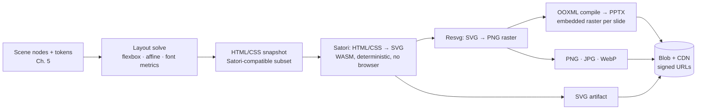

# Chapter 13 — Headless Export Engine (Satori, Resvg, OOXML)

## 13.1 Pipeline shape

Web-first editing, offline artifact generation (spec §13). The same render graph serves
previews and exports; the difference is the terminal: screen pixels vs. files.

Four deterministic stages, no browser on the worker (Ch. 12 §12.3):

1. **Layout solve** — reuse the editor's layout engine (Ch. 9) on the worker: flexbox
   tree → absolute positioned, font-metric-measured boxes per slide.
2. **CSS snapshot** — tokens (Ch. 5 §5.8) compile to the Satori CSS subset; no runtime
   JS, no dynamic `calc()`/modern CSS — the documented Satori constraint set is the
   contract, linted in CI.
3. **SVG via Satori** — WASM-based HTML/CSS→SVG; deterministic (same doc, same bytes).
4. **Raster via Resvg** — SVG→PNG at device-pixel-ratio scales (1×/2×/3× preview,
   export at 2× for print quality).

## 13.2 Format matrix

| Format | Path | Use | Notes |
|---|---|---|---|
| JSON | Native document export (Ch. 5) | Interop, versioning | schema-versioned, token-resolved |
| SVG | Satori output, un-rasterized | Vector reuse, MCP results | resolution-independent |
| PNG | Resvg raster (2×) | Slides, social posts | alpha preserved |
| JPG / WebP | PNG → compress | Web/thumbnail variants | quality ladder per CDN |
| PPTX | OOXML compile | Client decks | one slide per scene slide; images embedded; fonts referenced (license-aware) |

PPTX specifics: Open Packaging Convention ZIP with canonical `[Content_Types].xml`,
slide layouts mapped from the deck's layout detection output (Ch. 9), text as real
OOXML runs (not images) so clients can edit; images embedded as media parts; theme
colors mapped to the brand kit palette (Ch. 5 §5.8).

## 13.3 Worker implementation (Ch. 12 §12.3 mapping)

- **Queue**: `exports`; payload `{jobId, docId, format, quality, requester}`.
- **Cache**: artifact keyed by `sha256(document frontier + schema version + format)`;
  identical export requests hit Blob, no re-render (determinism is what makes this
  safe — 13.1 stage guarantee).
- **Completion**: artifact ref → `assets` table + signed URL; job notification on the
  Web PubSub jobs channel (Ch. 7); `ai_jobs`-style `exports` row persists for late
  pollers (Ch. 12 §12.3 step 4).
- **Isolation**: export workers get the memory-bounded profile (raster buffers are the
  peak allocator); concurrency 2 per worker (Ch. 12 §12.3 step 2).

## 13.4 Determinism & font handling

- Fonts: bundled subset of the brand fonts (Archivo/Inter/Roboto Mono per CLAUDE.md)
  served to Satori as WOFF2/TTF tables; missing-glyph fallback chain is part of the
  render hash input so cache keys can't collide across font changes.
- Determinism audit: double-render golden corpus and compare SHA-256 per format; any
  nondeterminism (dates, unicode bidi edge cases, hash ordering) fails CI.

## 13.5 Current-state migration (html2canvas → headless)

Today: client-side `html2canvas` screenshot of DOM decks. Problems: pixel variance
across browsers/DPR, no vector/PPTX, no server-side generation for MCP/automation.

1. Keep client export as-is behind a flag; add `/documents/:id/export` route + worker
   in parallel.
2. Flip the flag per workspace when parity passes: render-diff against html2canvas
   golden images with IoU-style acceptance (Ch. 9 tooling reused) on the 50-doc corpus.
3. Delete html2canvas paths; client export becomes "download artifact from URL"
   (Ch. 12 §12.3 step 4).

## 13.6 Implementation order & gates

1. Layout-solve reuse on worker (shared TS package with editor).
2. Satori SVG pipeline + font bundling + determinism CI check.
3. Resvg raster + DPR ladder; format matrix (SVG→PNG→JPG/WebP).
4. OOXML compile → PPTX with embedded images + brand theme mapping.
5. Cache keying + Blob/CDN artifacts + signed URLs; html2canvas flag flip.

**Gates:** double-render byte-identical on golden corpus; PPTX opens in PowerPoint +
Google Slides with editable text; export of a 100-slide deck < 60 s worker time;
cache hit rate > 70% on repeated exports; parity pass against html2canvas goldens
before flag flip.

---

© INNOIRA Consulting Services 2026 · CONFIDENTIAL
