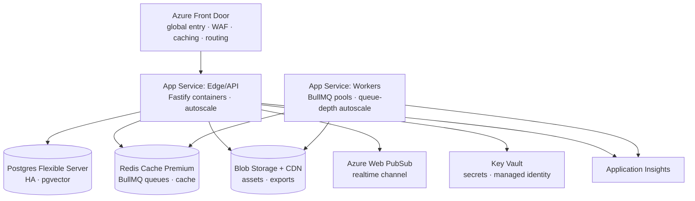

# Chapter 14 — Infrastructure (Azure: Front Door, App Service, Data)

## 14.1 Topology

All data-plane services reachable via **private endpoints** (VNet integration); public
exposure only through Front Door.

## 14.2 Entry & edge (Front Door)

- **Routing**: `/api/*` → Edge service; `/exports/*` → CDN-backed artifact origin
  (origin shield); static site → App Service static/Blob origin. Health probes per
  origin (Ch. 12 §12.5 `/ready`).
- **WAF policy**: managed rule sets + custom rate rules (per-IP auth throttling, LLM
  endpoint budgets — Ch. 8 §8.7 metering enforced at the edge too), geo filtering per
  tenant policy, bot management off for API paths.
- **Caching**: immutable static assets (content-hashed) cache 1 y; signed artifact
  URLs bypass caching via query-token variance; never cache `/api/*`.
- **TLS**: end-to-end TLS; certificate automation via Front Door-managed certs.

## 14.3 Compute (App Service, container-based)

| Plan | Service | Size (indicative) | Autoscale trigger |
|---|---|---|---|
| `api-plan` | Edge/API + Auth + Scene + Asset + MCP | S1 (1 vCPU/1.75 GB) ×2 min | CPU > 70% for 10 min; max 10 |
| `ai-plan` | AI pipeline workers | S2 ×1 min | BullMQ `ai-jobs` depth > 50 (custom metric); max 8 |
| `export-plan` | Export workers | S2 ×1 min | `exports` depth > 10; max 4 |

- **Containers, not built-in stacks**: ACR images with immutable tags; deployment slots
  (staging ↔ prod) for zero-downtime; slot swap = traffic cutover, workers drain via
  graceful shutdown (Ch. 12 §12.5).
- **Statelessness is the scaling contract** (Ch. 12 §12.1): any instance can serve any
  request; scale-out is therefore safe under load; scale-in has a 10 min cooldown to
  avoid flapping.
- **Workers stay off the public surface** — no inbound traffic; they only pull from
  Redis (outbound-only via VNet).

## 14.4 Data tier

**Redis (Azure Cache for Redis Premium)**
- BullMQ durability: AOF persistence + cluster mode for `ai-jobs`/`exports` queues;
  `noeviction` policy so queue entries are never silently dropped.
- Shared cache (session tokens, rate buckets, frontier cache) in the same instance,
  keyed by prefix; same VNet private endpoint.
- Scaling units: one P0 to start; queue depth autoscale is App Service-side, Redis
  grows only with sustained throughput.

**Postgres (Azure Database for PostgreSQL Flexible Server)**
- Zone-redundant HA; `pgvector` extension enabled from day one (Ch. 11 §11.6); PITR
  backup 7 days, geo-redundant weekly.
- Sizing: `GP_Standard_D2ds_v4` (2 vCPU/8 GB) to start; IOPS headroom for ledger
  appends (Ch. 11 — write amplification lives here, monitor `tps_wal`).
- pgBouncer pooled connections per service (Ch. 12 §12.5 pool sizing); private
  endpoint, no public IP.

**Blob + CDN**
- Tiering: exports hot (signed URL TTL), raw uploads cool after 30 d, audit archives
  cold. CDN origin for `/exports/*`; signed URLs via Key Vault-backed signing key.
- Current `carousel_images` Mongo GridFS-style serving (server.py) migrates here
  wholesale (Ch. 11 §11.4) — short-lived `?t=` tokens replaced by CDN signed URLs.

## 14.5 Real-time (Azure Web PubSub)

- Hub per workspace-namespace (`creq-{workspaceId}`), tiers: Free (≤20 concurrent,
  dev) → Standard (scaling units, prod). Reconnect semantics per Ch. 7 §7.4.
- Only the Edge service holds the connection string; clients get scoped tokens with
  per-hub ACLs (Ch. 7 §7.3).

## 14.6 Secrets, identity, observability

- **Key Vault**: all secrets (LLM keys incl. `PERPLEXITY_API_KEY`, `OPENAI_API_KEY`,
  `ANTHROPIC_API_KEY`, JWT signing, Blob signing, Redis/Postgres creds) as App
  Service **Key Vault references**; no `.env` files in containers (CLAUDE.md rule —
  never commit secrets, and never ship them either).
- **Managed identity** for service-to-service auth (Postgres/Redis/Blob/Key Vault);
  no static credentials in code.
- **Application Insights**: structured logs (request id, workspace id, frontier,
  queue depth) from the shared platform plugin (Ch. 12 §12.5); availability tests on
  `/ready`; custom metrics: per-queue depth, ledger append latency, export p95,
  per-provider LLM tokens/cost (Ch. 8 §8.7). Dashboards + alerts: error rate > 1%,
  queue age > 5 min, WAF blocked spike.

## 14.7 SKU summary (indicative monthly, early footprint)

| Component | SKU | ~USD/mo |
|---|---|---|
| Front Door Standard | standard tier + WAF policy | ~30 |
| App Service API | S1 ×2 instances | ~110 |
| App Service workers | S2 ×2 (AI+export) | ~110 |
| Redis Premium | P0 + AOF + cluster | ~55 |
| Postgres Flexible | GP D2ds_v4 HA | ~90 |
| Blob + CDN | hot/cool + traffic | ~10 |
| Web PubSub Standard | 1 scaling unit | ~35 |
| Key Vault / App Insights | standard | ~5 |
| **Total** | | **~450** |

Autoscale adds compute only under load; the floor is the cost of the stateless
minimum (2× API + 1× AI + 1× export).

## 14.8 Current-state migration

Today: single App Service (`innoira-api`, GitHub auto-deploy on push) + MongoDB +
client-side export. Steps:

1. Add Postgres Flexible + Redis + Key Vault alongside Mongo; keep FastAPI gateway
   on the existing plan (Ch. 12 §12.6 extraction order).
2. Stand up Fastify services as new plans behind Front Door; Front Door becomes the
   client-facing origin (CRA dev/prod env pointer flips once).
3. Move secrets into Key Vault references; rotate legacy env vars out.
4. Blob/CDN for exports once export workers land (Ch. 13 §13.5 flag flip).
5. Decommission Mongo after the 14-day rollback window closes (Ch. 11 §11.5).

**Gates:** no public endpoint except Front Door (network test in CI); zero secrets in
image/config (scan gate); autoscale demonstrated under synthetic load (queue depth
trigger); slot swap with zero failed requests during a deployment.

---

© INNOIRA Consulting Services 2026 · CONFIDENTIAL
