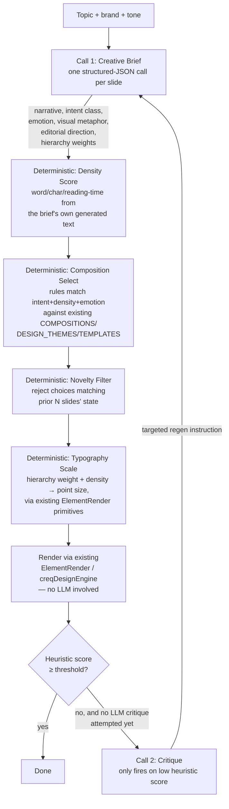

# Chapter 16 — Creative Reasoning Engine (Story → Composition → Critique)

**Status:** Proposal, not yet implemented. Captures the product owner's vision verbatim
(§16.1), current-state findings against that vision (§16.2), a pragmatic architecture that
fits the existing rendering stack instead of rebuilding it (§16.3), what to cut from today's
code (§16.4), and a cost/latency efficiency analysis (§16.5). **Do not implement without
explicit go-ahead** — this chapter is reference-only until then.

## 16.1 Original vision (verbatim, product owner, 2026-08-05)

> I think you're trying to solve a different problem than "copy Claude's colors." After
> digging into everything publicly available — including Anthropic's Claude Design
> documentation, discussions from designers testing it, and reverse-engineering
> observations — I'm convinced Claude's advantage is not its design system. It's its
> design engine. Anthropic describes Claude Design as extracting and reusing complete
> design systems (components, layouts, typography, spacing, patterns) from codebases and
> design assets, rather than relying on a fixed internal visual style.
>
> **What CreateEQ is missing:** CreateEQ already has colors, typography, layouts, AI
> prompts, templates, styles, brand themes. Yet the output still feels "AI generated."
> That happens because nearly every AI carousel builder follows: *Topic → Generate text →
> Choose template → Place text → Done.* Claude's pipeline is closer to: *Understand →
> Think → Art Direct → Story → Layout → Typography → Composition → Color → Micro Details
> → Render* — layout comes almost in the middle, not the beginning.
>
> **~15 hidden reasoning stages, reverse-engineered from Claude's output:**
>
> 1. **Narrative Engine** — before designing, ask "what story is this slide telling?"
>    not "what title goes here?" Each slide gets Emotion → Message → Visual metaphor →
>    Evidence → Action.
> 2. **Visual Intent Classification** — every slide classified (Warning, Celebration,
>    Proof, Comparison, Timeline, Failure, Success, Statistics, Framework, Prediction,
>    Story, Quote, Lesson, Question, Call to action, Checklist, Myth, Reality), each with
>    its own visual language instead of one layout for all slides.
> 3. **Visual Density Score** — words → characters → reading time → complexity → visual
>    density (low/medium/high), driving typography size and whether the slide gets a
>    grid/columns/cards or huge type + large margins.
> 4. **Visual Hierarchy Generator** — every object gets an importance weight (Hero 90%,
>    Support 40%, Decoration 15%; e.g. Headline 100, Image 90, Statistic 75, Body 45,
>    Caption 20, Icon 10) — layout becomes a function of weight, not a template pick.
> 5. **Scene Generator** — "what real-world scene represents this idea?" (Chaos → messy
>    desk; Growth → climbing staircase; Automation → domino chain; Trust → handshake;
>    Delay → traffic) instead of generic "AI illustration."
> 6. **Editorial Direction** — pick an art-director register (Magazine, Poster,
>    Billboard, Report, Financial, Luxury, Startup, Minimal, Swiss, Apple, Documentary,
>    Architecture, Scientific) *before* layout.
> 7. **Composition Engine** — golden ratio, rule of thirds, diagonal flow, Z/F pattern,
>    asymmetry, negative space, radial, split composition, editorial crop — a different
>    composition per slide, not "center, center, center."
> 8. **Eye Tracking Prediction** — predict the reading path (Headline → Visual →
>    Highlight → CTA); rebuild the layout if the predicted path looks confusing.
> 9. **Tension Engine** — deliberate imbalance (huge title/tiny image on one slide, tiny
>    title/massive photo on the next) for rhythm, the way real designers do and AI
>    usually doesn't.
> 10. **Rhythm Engine** — vary slide *pace* across the deck (poster → photo → diagram →
>     quote → comparison → timeline → CTA) instead of repeating one card shape.
> 11. **Object Relationship Graph** — elements know their relationship to each other
>     ("image supports title," "number aligns chart"), not just independent
>     image/text/shape.
> 12. **Typography Intelligence** — hierarchy, not fixed point sizes: one word gets ~140px,
>     a sentence ~32px, evidence ~18px, driven by what the text *is*, not a fixed scale.
> 13. **Emotion Engine** — one emotion per slide (Urgency, Hope, Luxury, Curiosity, Fear,
>     Confidence, Authority, Wonder, Excitement, Calm) driving color, spacing, image,
>     composition, motion together, not independently.
> 14. **Visual Novelty Score** — avoid repeating the previous slide's choices (same
>     shape, same accent color, same photo-vs-illustration) — this is why Claude's
>     outputs feel varied instead of stamped from one template.
> 15. **Self Critique** — score every slide against hierarchy, spacing, contrast,
>     balance, alignment, readability, novelty, consistency, emotional fit, brand
>     compliance; if below threshold, regenerate only the weak aspects, not the whole
>     slide.
>
> **Target architecture:** Topic → Story Engine, Audience Engine, Emotion Engine,
> Editorial Direction Engine, Narrative Arc Engine, Visual Intent Classifier, Visual
> Metaphor Engine, Composition Engine, Eye Tracking Simulator, Typography Engine, Layout
> Engine, Image Director, Color Director, Micro-detail Generator, Accessibility
> Validator, Novelty Detector, Design Critic, Final Renderer.
>
> Not "more templates or better prompts" — turn CreateEQ from an AI carousel generator
> into an AI Creative Director, built as a **multi-agent creative pipeline** where each
> agent has one responsibility (storytelling, art direction, composition, typography,
> critique) and they iteratively refine the output, closer to how a real creative team
> works.

## 16.2 Current-state findings (verified against the code, 2026-08-05)

Every claim below is a direct citation, not an inference — checked before writing this
chapter so the plan in §16.3 doesn't get built on a wrong assumption about what already
exists.

| Vision stage | Current state | Evidence |
|---|---|---|
| Narrative Engine | **Absent.** One prompt asks for hook/body/cta labels only, no emotion/metaphor/evidence/action breakdown. | `server.py:4145-4152` |
| Visual Intent Classification | **Half-built, then discarded.** Backend emits `kind: hook\|body\|cta` specifically so layout could branch on it. | `server.py:4159` produces `kind`; grep of every `.jsx` under `components/creq/` and both `CreateEQEditor.jsx`/`CreateEQProjects.jsx` finds **zero** reads of `kind` |
| Visual Density Score | **Absent.** No word/char/reading-time calculation anywhere backend or frontend. | grepped, no matches |
| Visual Hierarchy weights | **Absent.** Fixed slot sizes regardless of content. | `CreateEQEditor.jsx:48-57` (`legacySlideToElements`) hardcodes `size: 132/32/24` for every slide |
| Scene Generator (visual metaphor) | **Closest existing analog, but manual/on-demand.** Turns slide text into photo *concepts* (search phrases), not literal keywords. | `asset_engine.py:132-154` (`derive_search_terms`), invoked only when a user opens the asset-search drawer |
| Editorial Direction | **Exists as static presets, never content-selected.** 12 named style bundles. | `creqDesignEngine.js:311-432` (`DESIGN_THEMES`) — applied only via manual click |
| Composition Engine | **Exists as static presets, never content-selected.** 10 canned decorative clusters. | `creqDesignEngine.js:236-307` (`COMPOSITIONS`) |
| Eye Tracking Prediction | **Absent.** | no analog found |
| Tension / Rhythm Engine | **Absent.** Every AI-generated slide uses the identical layout. | `legacySlideToElements` applies the same coordinates regardless of slide index or `kind` |
| Object Relationship Graph | **Absent.** Elements are independent x/y/w/h with no relational data. | element schema throughout `ElementRender.jsx` |
| Typography Intelligence | **Absent.** Fixed point sizes, no text-measurement/auto-fit logic. | grepped `ElementRender.jsx`/`utils.js`, no `measureText`/`autoFit`/font-shrink logic exists |
| Emotion Engine | **Reduced to a free-text tone string** passed straight into the prompt, not mapped to color/spacing/composition. | `AUDIENCES` tone strings → `server.py:4145` prompt interpolation |
| Visual Novelty Score | **Absent.** No cross-slide state tracking of prior color/shape/image choices. | no analog found |
| Self Critique | **Absent for carousels.** A scoring feature exists ("EQ Score") but scores cold email quality, unrelated to slides. | `server.py:268, 3092-3162` — different feature entirely |

**What already exists that a redesign should reuse, not rebuild:** the rendering
primitives are real and separable from the (currently nonexistent) decision logic —
`ElementRender.jsx` (566 lines, pure paint, no decisions), `creqTemplates.js` (984
lines, 40 templates + 10 palettes + 10 fonts), `creqDesignEngine.js` (432 lines, 12
themes + 10 compositions + 60 image frames), `creqCharts.js`, `creqIconSets.js`,
`creqIllustrations.jsx`. None of this needs to be thrown away — it needs a decision
layer sitting *above* it that currently doesn't exist at all.

**Scale today:** ~600 backend lines (`server.py:4078-4830`, `asset_engine.py`), ~10,100
frontend lines. One LLM call per deck generation, full stop — see call-path trace in
§16.3.1 for exactly where the new stages slot in.

## 16.3 Proposed architecture

### 16.3.1 The core efficiency decision: stages ≠ API calls

The vision's 15 "stages" describes 15 *reasoning steps*, not 15 *sequential network round
trips*. Building it as 15 literal chained LLM calls would be the wrong implementation —
see §16.5 for why. The right mapping is: **collapse reasoning steps that are genuinely
inter-dependent into one structured-output call each; do the purely arithmetic/rules-based
steps in code, not the model; keep the total to 2-4 LLM calls per slide (not per deck) in
the common case.**



**Call 1 — Creative Brief** (replaces today's single `_llm_chat` in `carousel_generate`,
`server.py:4159`): one structured-JSON call per slide (or a batched call for the whole
deck, trading a little cross-slide awareness for latency — see §16.5) that does stages
1, 2, 5, 6, 9-partially, 13 *in one completion*, because a single well-specified JSON
schema lets a modern model reason through narrative → intent → metaphor → editorial
register → emotion in one pass exactly as well as five separate calls would, without five
round trips. Extend today's schema:

```json
{
  "kind": "warning|celebration|proof|comparison|timeline|failure|success|statistics|framework|prediction|story|quote|lesson|question|cta|checklist|myth|reality",
  "narrative": { "emotion": "concern", "message": "...", "visual_metaphor": "empty inbox / abandoned mailbox", "evidence": "...", "action": "..." },
  "editorial_direction": "swiss|minimal|magazine|financial|startup|...",
  "emotion_primary": "urgency|hope|luxury|curiosity|fear|confidence|authority|wonder|excitement|calm",
  "hierarchy": [{ "role": "headline", "weight": 100 }, { "role": "image", "weight": 90 }, { "role": "body", "weight": 45 }],
  "title": "...", "subtitle": "...", "body": "...", "cta": "..."
}
```

**Deterministic code (no LLM), added to the backend or a thin edge function:**
- *Density Score* (stage 3): pure arithmetic on the brief's own returned text —
  `word_count`, `char_count`, `reading_time = words / 200wpm`, bucketed low/med/high.
  This never needs the model; asking an LLM to count words it just wrote is wasted
  latency and occasionally wrong.
- *Composition/Editorial selection* (stages 6, 7, 10): a rules table mapping
  `(kind, density, emotion, editorial_direction)` → one of the **existing** 10
  `COMPOSITIONS` / 12 `DESIGN_THEMES` / 40 `TEMPLATES` entries. This is the single
  biggest cost/complexity saver in the whole plan — stage 7's "Composition Engine"
  sounds like it needs new geometry-solving code, but the geometry already exists
  (`creqDesignEngine.js`); what's missing is only the *selection function*, which is a
  lookup table plus light randomization for novelty, not an LLM call.
- *Typography Intelligence* (stage 12): `hierarchy weight + density bucket → point size`
  is a deterministic formula (e.g. `size = base * (weight/100) * densityFactor`), not a
  reasoning task. This is genuinely new frontend code (nothing like it exists today —
  confirmed absent in §16.2), but it's a measurement/math function, not an AI call.
- *Novelty Score* (stage 14): pure state — track the last 2-3 slides' composition id,
  accent color, and image-vs-illustration choice in the deck doc; reject/reroll a
  composition-select result that collides. No LLM needed; this is exactly the kind of
  thing that's cheap and fast as code and unnecessarily slow/nondeterministic as a
  model call.
- *Eye Tracking Prediction* (stage 8): approximate with a rule (hierarchy-weight order
  should roughly match reading order — top-to-bottom / left-to-right for the given
  composition) rather than a genuine gaze-prediction model; flag composition choices
  that put a weight-20 element above a weight-100 element for a second composition pass.
- *Object Relationship Graph* (stage 11): a small structured field already comes for
  free from the Creative Brief's `hierarchy` array plus the composition template's
  known slot relationships (e.g. `TEMPLATES` entries already define "image anchors
  title" implicitly via fixed positions) — formalize into an explicit `relates_to`
  field on generated elements rather than building a separate graph-reasoning stage.

**Call 2 — Critique** (stage 15), **conditional, not always-on**: compute a cheap
heuristic score first (contrast ratio via existing color math, spacing/alignment via
element bounds, hierarchy-order-vs-composition-order match from the eye-tracking rule
above) — only invoke an LLM critique call when the heuristic score is below threshold,
and only regenerate the specific weak field it flags (e.g. "body copy too long for this
density bucket," "title/CTA emotional mismatch"), not the whole slide. Most decks in
practice should never trigger call 2 for well-formed input.

**Render** (stage "Final Renderer"): zero LLM involvement — it's applying the selected
composition/theme/typography values through the **existing** `ElementRender.jsx` /
`creqDesignEngine.js` primitives, the same code path today's manual "apply template"
button already uses. This is the parts of the vision that require no new architecture
at all, only wiring.

### 16.3.2 Where this plugs into the existing (already-planned) architecture

This chapter's Creative Brief call is a richer version of the `deck.generate` task
already catalogued in Ch. 8 §8.6 — same `POST /carousel/generate` entrypoint, same A2UI
task-envelope/validation-gate machinery (Ch. 8 §8.4), extended schema. The deterministic
composition/typography selection in §16.3.1 is new logic that sits **between** Ch. 8's
`deck.generate` output and Ch. 9's `layout.solve` — Ch. 9 only converts an *already-
decided* absolute layout into a responsive flex tree; it has no opinion on what that
layout should creatively be. This chapter is the missing decision layer Ch. 9 assumes
exists upstream of it.

## 16.4 What to remove or retire from the existing system

1. **`legacySlideToElements()` (`CreateEQEditor.jsx:48-57`) — retire entirely.** This is
   the literal embodiment of the "topic → generate text → place text, one fixed layout"
   problem the vision describes. It's the single piece of code most directly replaced
   by the new pipeline (Creative Brief → density → composition-select → typography-scale
   → render). Nothing else in the frontend depends on its specific output shape beyond
   "an elements array," so replacing its call sites is contained.
2. **The dead `kind` field's current no-op status — extend, don't remove.** It's not
   wasted code to delete, it's an already-correct hook that was never wired up; the new
   pipeline finally gives it a consumer. Expand its enum from 3 values (hook/body/cta)
   to the vision's ~17-value taxonomy (warning/celebration/proof/comparison/... — see
   schema in §16.3.1).
3. **Do NOT delete the 40 `TEMPLATES` / 12 `DESIGN_THEMES` / 10 `COMPOSITIONS`.** These
   become the selection *targets* for the new deterministic composition-selector, and
   they stay exactly as valuable as they are today for manual editing (a user browsing
   and clicking a template in `LeftPanel.jsx` is a legitimate, separate use case from AI
   generation and shouldn't regress). If anything, this pipeline is the reason to
   eventually *grow* that library rather than shrink it — more composition variety
   directly improves the novelty engine's option pool.
4. **Free-text `tone` string prompt interpolation (`server.py:4145`) — replace with the
   structured `emotion_primary` enum** from the Creative Brief schema. A closed enum is
   what makes emotion → color/spacing/composition mapping deterministic and testable;
   free text can't drive a rules table.
5. **Nothing in the rendering stack (`ElementRender.jsx`, `shapes.jsx`, `creqCharts.js`,
   `creqIconSets.js`, `creqIllustrations.jsx`) needs to change.** These are pure
   paint-from-data primitives already; the redesign is entirely about what data feeds
   them, not how they render it. This is most of the ~10,100 frontend lines, and it's
   the part of the estimate that keeps this a scoped addition rather than a rewrite.

## 16.5 Efficiency analysis

**Why NOT 15 literal sequential LLM calls per slide:** at a conservative ~1.5-3s per
Claude completion, 15 serialized calls is 22-45+ seconds of pure network/inference
latency *per slide*, before any rendering — a 6-slide deck would take 2-4+ minutes and
cost roughly 15x today's per-deck token spend. That's not a viable interactive product
experience (today's single-call generation is the whole reason `/carousel/generate`
feels instant); it would also make the credits/quota economics (Ch. 8 §8.2's per-action
metering) 15x worse per generation for no proportional quality gain, since most of those
15 "stages" don't actually need independent model reasoning (see the deterministic-code
breakdown in §16.3.1).

**Proposed shape's actual cost, per slide:**
- **Common case (heuristic score passes):** 1 LLM call (Creative Brief) + ~4
  deterministic functions (density, composition-select, novelty-filter, typography-scale)
  that run in milliseconds, no network round trip. Versus today's 1 call — this is
  **~1x the LLM cost of today**, not 15x, because the schema is richer per call rather
  than the call count going up.
- **Escalation case (heuristic score fails):** +1 LLM call (targeted Critique/regen of
  the flagged field only, not the whole slide) — **~2x today's cost**, and only for the
  fraction of slides that actually need it.
- **Deck-level batching option:** generating the Creative Brief for all N slides in one
  call (richer schema, `slides: [...]`) instead of N separate calls trades a small
  amount of per-slide focus for an N-1x reduction in round trips — worth prototyping
  both and measuring quality difference before committing, since deck-level context
  (what have earlier slides already said/shown) is also what stage 14's Novelty Engine
  needs anyway, which argues for the batched-deck-call shape over the per-slide shape.
- **Net latency:** roughly today's single-call latency (~2-5s) in the common case, plus
  a bounded second call only on the minority of slides that fail the heuristic gate —
  not a 15-stage serial chain.

**Where the real net-new engineering cost is** (this is the honest effort estimate, not
the LLM cost): the deterministic composition-selection rules table (§16.3.1) and the
typography auto-scale function are genuinely new code that doesn't exist in any form
today (confirmed by direct grep in §16.2) — this is real frontend/backend engineering
work, not just a prompt change, and is the part of this proposal that should be scoped
and estimated separately from "add a richer LLM schema."

## 16.6 Open questions before implementation

1. Per-slide vs. per-deck Creative Brief call — needs a quality/latency prototype, not
   just an estimate (§16.5).
2. Where does the deterministic composition-selection rules table live — Python
   (`backend/server.py` alongside the existing endpoint) or JS (frontend, colocated with
   `creqDesignEngine.js`, which already owns the target data it selects from)? Frontend
   placement avoids an API round trip for a decision that's pure data lookup once the
   Creative Brief JSON is in hand.
3. Heuristic score thresholds (§16.3.1's contrast/spacing/hierarchy-order checks) need
   concrete formulas before Call 2's gate can be built — not specified yet, flagged here
   so it isn't silently assumed away.
4. How this interacts with Ch. 8's BullMQ worker-pool plan (P1) — the Creative Brief +
   Critique calls are exactly the shape Ch. 8 already designed workers for
   (`deck-generator`, `slide-regenerator`); this chapter should slot into that queue
   design rather than getting built as a second, parallel inline-call pipeline.

---

## 16.7 The Claude Design system (implemented 2026-08-06)

§16.3's pipeline shipped first as v3 and **did not meet the bar**. The failure is worth
recording precisely, because the lesson generalises beyond this feature.

### 16.7.1 Why v3 looked wrong

Three root causes, none of which were prompt-quality problems:

1. **Colour was delegated to the model.** v3 asked for a "cohesive 5-colour identity" and
   got back five plausible-sounding hex values per deck. An LLM asked to invent a palette
   returns generic colour, because palette construction is a *design-system* decision made
   once, not a per-request creative one. No amount of prompt tightening fixes that — the
   question itself was wrong.
2. **Layout was top-flushed.** Every composition stacked from the top margin down, so any
   slide with little copy rendered as a small huddle of text above a dead lower half.
3. **Content was untyped.** Everything was squeezed into `title`/`subtitle`/`body`, and the
   renderer tried to *recover* structure at draw time — list items were guessed by
   splitting body copy on sentence boundaries. Structure that the copy never had cannot be
   recovered; it can only be invented, and it looked invented.

### 16.7.2 What replaced it

`frontend/src/lib/creqClaudeDesign.js` — the model now chooses **from** a system instead of
inventing one. It picks a `palette_family` and, per slide, an `archetype` plus *typed*
content. Every hex, size, leading, margin, rule weight and anchor comes from the system.

The reverse-engineered characteristics the tokens encode:

| Trait | Value |
| --- | --- |
| Paper | Warm, not white — `#FAF9F5` / `#F0EEE6` |
| Ink | Warm near-black `#191919`, never `#000` |
| Accent | Exactly one chromatic (clay `#D97757`), darkened on light surfaces so small accent text still clears 4.5:1 |
| Display | High-contrast serif at 1.02–1.05 leading |
| Body | Quiet grotesque at ~1.55 leading — the *gap* between the two does most of the work |
| Margins | ~9.3% per side, on a real 12-column grid |
| Anchoring | Optical (centre biased 3% high, or bottom) — never top-flushed by default |
| Furniture | Hairline rules and tracked mono eyebrows, never filled pills |
| Rhythm | Mostly paper, punctuated by ink/clay; two dark slides never adjacent |

Surface rhythm is decided at **deck** level (`planSurfaces()`), not per slide — which slides
go dark is a property of the sequence, and a per-slide loop structurally cannot decide it.
That is why `buildPremiumDeck()` replaced the old per-slide entry point.

Per-slide surfaces are emitted as **literal hex**, not palette tokens. This is what allows
one deck to mix light and dark slides at all: a token like `text` cannot invert per slide.
It works because `resolveColor()` falls through to the raw string for non-token values.

### 16.7.3 Bugs this surfaced (all fixed, all the same shape)

Each was a case of two systems disagreeing about geometry:

- **The audit fought the composer.** Both estimated text height, but with different
  average-glyph-width constants, so the audit "corrected" boxes that were already right and
  pushed them into their neighbours. Unified on `charRatio()`. This alone took geometry
  corrections from 1–4 per slide to **zero**.
- **Overlap detection ignored the x-axis.** Any two-column layout was read as a collision
  and the right column was shoved below the left one.
- **Attached elements drifted from what they were attached to.** A CTA label positioned
  relative to its button was moved independently of it and ended up outside the button.
  Fixed by distinguishing *flowed* text (`text()`, movable) from *placed* text (`place()`,
  positioned relative to something else, never a push target).

The general lesson: when two passes both compute the same property, they must share one
implementation, or the second will silently undo the first.

### 16.7.4 Verification

`buildPremiumDeck()` is pure and canvas-parameterised, so it is testable headlessly without
a browser or an LLM call. Verified across LinkedIn 4:5, IG square, IG story 9:16 and a
custom 640×800: no overflow, no overlap, and zero geometry corrections needed. Also verified
against legacy v3 slides, slides missing their archetype's required fields, and
pathologically long copy (~1400 chars into a 30-word slot, which shrinks and stays composed
rather than clipping).

---

© INNOIRA Consulting Services 2026 · CONFIDENTIAL
